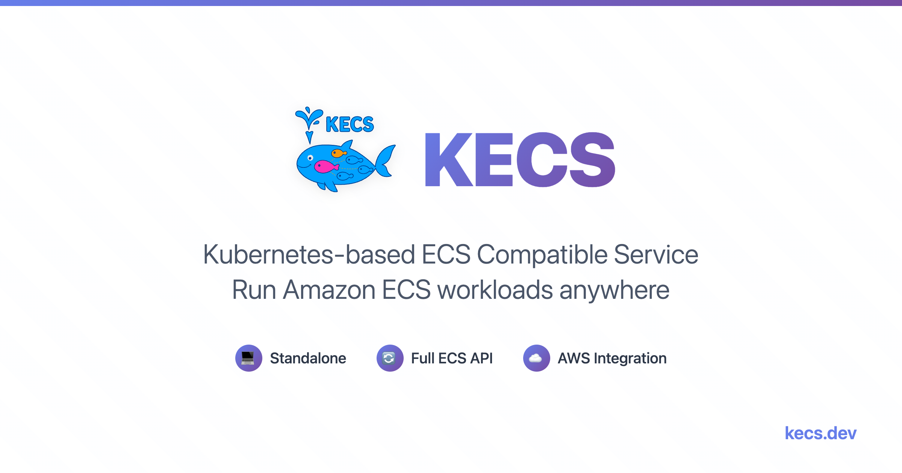
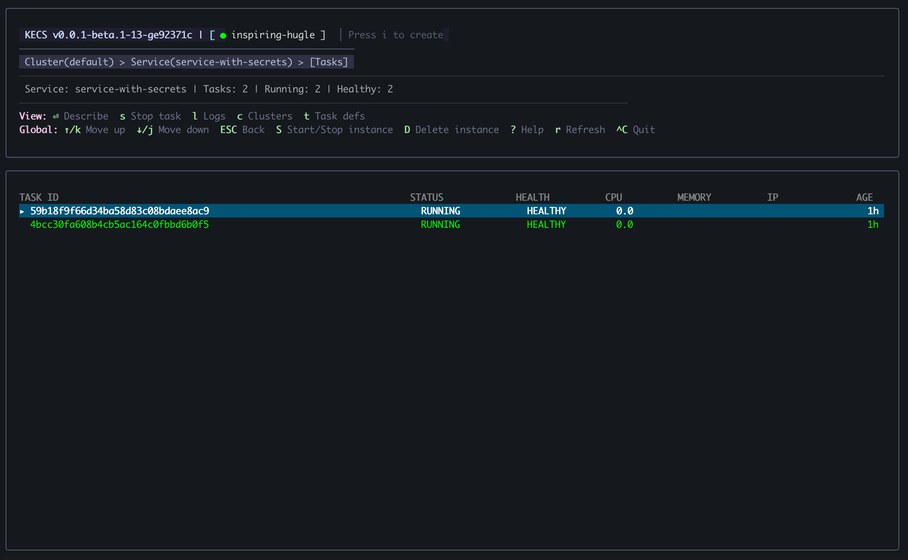
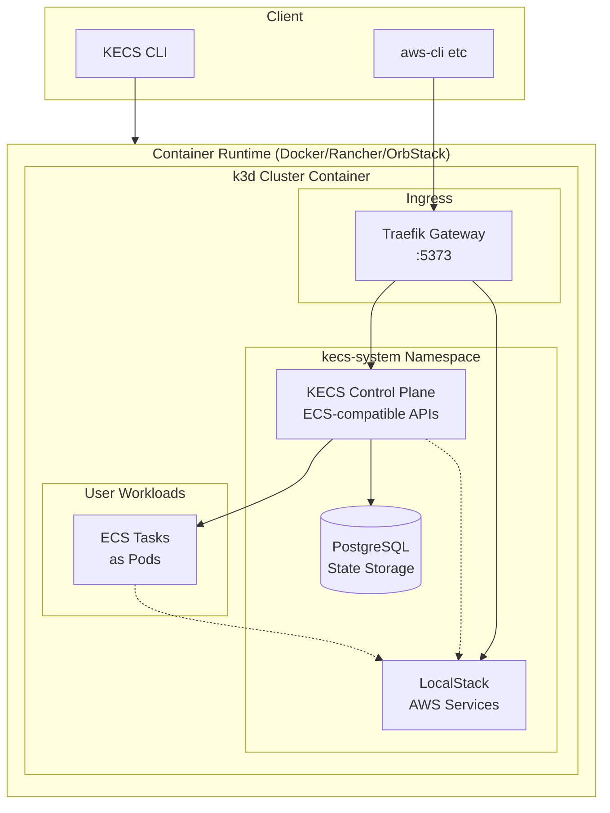

<div align="center">
  

  # KECS
  
  **Kubernetes-based ECS Compatible Service**
</div>

<div align="center">

[](https://github.com/nandemo-ya/kecs/actions/workflows/build-and-release.yml)
[](https://github.com/nandemo-ya/kecs/releases/latest)
[](https://golang.org/)
[](https://github.com/nandemo-ya/kecs/pkgs/container/kecs)
[](https://github.com/nandemo-ya/homebrew-kecs)
[](https://opensource.org/licenses/Apache-2.0)
[](https://goreportcard.com/report/github.com/nandemo-ya/kecs)
[](https://pkg.go.dev/github.com/nandemo-ya/kecs)
[](https://github.com/nandemo-ya/kecs)
[](https://github.com/nandemo-ya/kecs/pulls)

</div>

## Overview

KECS (Kubernetes-based ECS Compatible Service) is a standalone service that provides Amazon ECS compatible APIs running on Kubernetes. It enables a fully local ECS-compatible environment that operates independently of AWS environments.

> **Note:** KECS is designed for local development and CI environments only. Not for production use.

### Key Features

- **ECS API Compatibility**: Provides API endpoints compatible with Amazon ECS
- **Kubernetes Backend**: Leverages Kubernetes for container orchestration
- **Local Execution**: Runs completely locally without AWS dependencies
- **Container Runtime Support**: Works with both Docker and containerd (k3s, k3d, Rancher Desktop)
- **Container-based Background Execution**: Run KECS in containers with simple commands
- **Multiple Instance Support**: Run multiple KECS instances with different configurations
- **CI/CD Integration**: Easily integrates with CI/CD pipelines
- **Built-in LocalStack Integration**: Automatically provides local AWS services (IAM, SSM, Secrets Manager, etc.) for ECS workloads

### AWS Integration Support Status

KECS provides strong AWS service integration while remaining completely standalone. Here's the current support status for AWS services that ECS typically integrates with:

| AWS Service | Status | Description |
|-------------|--------|-------------|
| **ELBv2** (Application Load Balancer) | 🟡 Experimental | Target group and load balancer management |
| **Secrets Manager** | 🟡 Experimental | Secret injection into containers |
| **Parameter Store** | 🟡 Experimental | Parameter injection into containers |
| **CloudWatch Logs** | 🟡 Experimental | Container log streaming |
| **Cloud Map** (Service Discovery) | 🟡 Experimental | Service registry and discovery |
| **IAM** | ⚪ Pending | Task roles and execution roles |
| **VPC** | ⚪ Pending | Network isolation and security groups |
| **EFS** | ⚪ Pending | Elastic File System mounting |

**Legend:**
- 🟢 **Stable**: Production-ready with comprehensive testing
- 🟡 **Experimental**: Basic functionality available, under active development
- ⚪ **Pending**: Planned for future releases

## Installation

### Prerequisites

KECS requires a Docker-compatible environment to manage k3d clusters:
- **Docker Desktop** (macOS, Windows, Linux)
- **Rancher Desktop** (macOS, Windows, Linux)
- **OrbStack** (macOS)
- **Colima** (macOS, Linux)
- Or any other Docker-compatible runtime

### Using Homebrew (macOS/Linux)

```bash
# Install KECS
brew tap nandemo-ya/kecs
brew install kecs

# Verify installation
kecs version
```

### From Source

```bash
git clone https://github.com/nandemo-ya/kecs.git
cd kecs
make build
```

## Quick Start

### Running KECS

KECS runs its control plane inside a k3d cluster, providing better integration and a unified AWS API endpoint:

```bash
# Start KECS
kecs start

# This creates a k3d cluster with:
# - KECS control plane (ECS/ELBv2 APIs)
# - LocalStack (other AWS services)
# - Traefik gateway (unified routing)
```

All AWS APIs are accessible through the unified endpoint:
```bash
export AWS_ENDPOINT_URL=http://localhost:5373
aws ecs list-clusters              # → KECS
aws elbv2 describe-load-balancers  # → KECS
aws s3 ls                          # → LocalStack
```

To stop or destroy KECS:
```bash
# Stop KECS (preserves data)
kecs stop

# Destroy KECS (removes all data and resources)
kecs destroy
```

### Terminal User Interface (TUI)

KECS provides an interactive Terminal User Interface for managing your ECS resources visually:



```bash
# Launch the TUI
kecs

# The TUI provides:
# - Visual overview of clusters, services, and tasks
# - Real-time status updates
# - Keyboard navigation and shortcuts
# - Resource details and logs viewing
```

## Usage

For detailed usage instructions, API documentation, and examples, visit our documentation site:

📚 **[https://kecs.dev](https://kecs.dev)**

## Architecture

KECS uses a modern architecture where the control plane runs inside a k3d cluster:



Key Components:

1. **CLI Tool**: Manages k3d cluster lifecycle (start, stop, status)
2. **Control Plane**: Runs as pods inside the k3d cluster, providing ECS and ELBv2 APIs
3. **Unified Gateway**: Traefik routes AWS API calls to appropriate services (KECS or LocalStack)
4. **State Storage**: PostgreSQL provides persistent storage for ECS resources
5. **Workload Execution**: ECS tasks run as Kubernetes pods

## Acknowledgments

KECS integrates with [LocalStack](https://localstack.cloud/) to provide comprehensive AWS service emulation. We deeply appreciate the LocalStack team's work in making local AWS development accessible to everyone. Their excellent AWS emulation capabilities enable KECS to offer a complete local ECS development experience.

## License

This project is licensed under the Apache License 2.0 - see the [LICENSE](LICENSE) file for details.