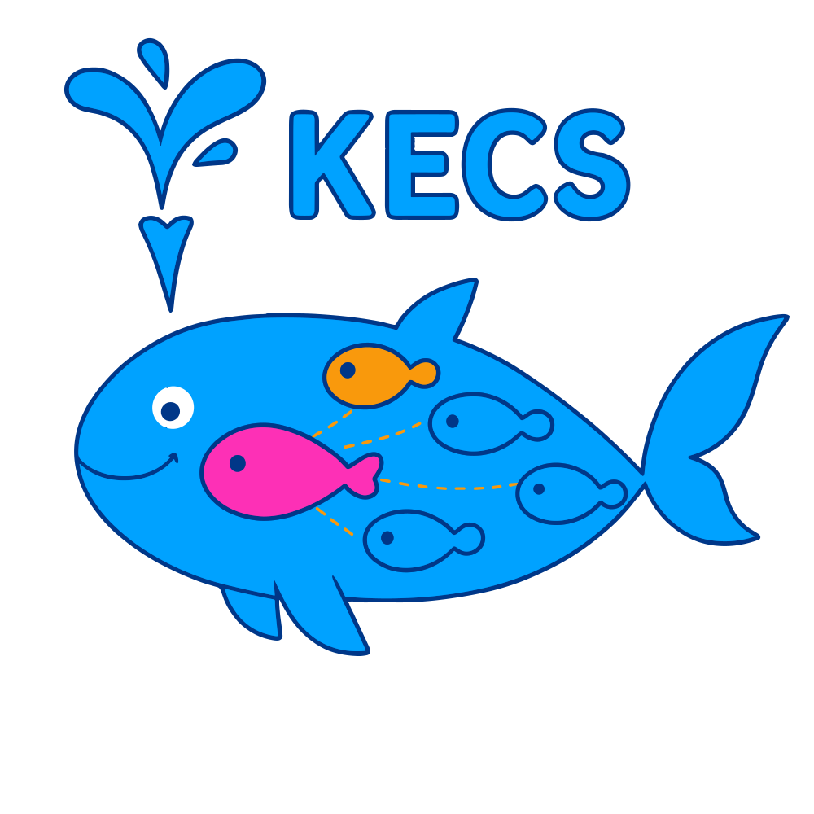

<div align="center">
  
  
  # KECS
  
  **Kubernetes-based ECS Compatible Service**
</div>

<div align="center">

[](https://github.com/nandemo-ya/kecs/actions/workflows/ci.yml)
[](https://codecov.io/gh/nandemo-ya/kecs)
[](https://golang.org/)
[](https://opensource.org/licenses/Apache-2.0)
[](https://github.com/nandemo-ya/kecs/releases/latest)
[](https://goreportcard.com/report/github.com/nandemo-ya/kecs)
[](https://pkg.go.dev/github.com/nandemo-ya/kecs)

</div>

## ⚠️ Security Notice - Please Read

**KECS is designed exclusively for local development and CI environments.**

KECS requires access to the Docker daemon to create and manage local Kubernetes clusters. This provides significant capabilities:

- **Full access to Docker daemon** (equivalent to root access)
- **Ability to create, modify, and delete containers**
- **Access to the host filesystem through volume mounts**
- **Network configuration capabilities**

### ✅ Supported Environments
- Local development machines  
- CI/CD pipelines (GitHub Actions, GitLab CI, Jenkins, etc.)  
- Isolated test environments  

### ❌ NOT Supported/Unsafe
- Production environments  
- Public-facing deployments  
- Multi-tenant systems  
- Environments with untrusted users  

**By using KECS, you acknowledge that:**
1. You understand the security implications
2. You trust KECS with Docker daemon access
3. You will only use KECS in supported environments

### First Run

On first run, KECS will display a security disclaimer and request acknowledgment. To skip this in automated environments:

```bash
# Set environment variable
export KECS_SECURITY_ACKNOWLEDGED=true

# Or add to config file
echo "features.securityAcknowledged: true" >> ~/.kecs/config.yaml
```

## Overview

KECS (Kubernetes-based ECS Compatible Service) is a standalone service that provides Amazon ECS compatible APIs running on Kubernetes. It enables a fully local ECS-compatible environment that operates independently of AWS environments.

### Key Features

- **ECS API Compatibility**: Provides API endpoints compatible with Amazon ECS
- **Kubernetes Backend**: Leverages Kubernetes for container orchestration
- **Local Execution**: Runs completely locally without AWS dependencies
- **Container Runtime Support**: Works with both Docker and containerd (k3s, k3d, Rancher Desktop)
- **Container-based Background Execution**: Run KECS in containers with simple commands
- **Multiple Instance Support**: Run multiple KECS instances with different configurations
- **CI/CD Integration**: Easily integrates with CI/CD pipelines
- **Built-in LocalStack Integration**: Automatically provides local AWS services (IAM, SSM, Secrets Manager, etc.) for ECS workloads

## Quick Start

### Running KECS

KECS runs its control plane inside a k3d cluster, providing better integration and a unified AWS API endpoint:

```bash
# Start KECS
kecs start

# This creates a k3d cluster with:
# - KECS control plane (ECS/ELBv2 APIs)
# - LocalStack (other AWS services)
# - Traefik gateway (unified routing)

# Check status
kecs cluster info

# Stop KECS
kecs stop
```

All AWS APIs are accessible through port 4566:
```bash
export AWS_ENDPOINT_URL=http://localhost:4566
aws ecs list-clusters         # → KECS
aws elbv2 describe-load-balancers  # → KECS  
aws s3 ls                     # → LocalStack
```

### Running Multiple Instances

KECS supports running multiple instances with different configurations:

```bash
# Start with custom instance name and ports
kecs start --instance dev --api-port 8080 --admin-port 8081
kecs start --instance staging --api-port 8090 --admin-port 8091

# Or use auto-generated instance name
kecs start  # Generates a random instance name

# Stop a specific instance
kecs stop --instance dev

# Stop instance with interactive selection
kecs stop  # Shows a list to select from
```

## Installation

### From Source

```bash
git clone https://github.com/nandemo-ya/kecs.git
cd kecs/controlplane
make build
```

### Development Setup

For contributors, we use [Lefthook](https://github.com/evilmartians/lefthook) to ensure code quality with git hooks:

```bash
# Run the setup script (installs Lefthook and configures git hooks)
./scripts/setup-lefthook.sh

# Or install manually
brew install lefthook  # macOS
# or
curl -sSfL https://raw.githubusercontent.com/evilmartians/lefthook/master/install.sh | sh -s -- -b /usr/local/bin  # Linux

# Install git hooks
lefthook install
```

The git hooks will:
- **Pre-commit**: Run unit tests, go fmt, and go vet for changed files
- **Pre-push**: Run the full test suite with race detection

To skip hooks temporarily: `git commit --no-verify` or `git push --no-verify`

### Using Docker

```bash
docker pull ghcr.io/nandemo-ya/kecs:latest
```

## Usage

### Required Permissions

KECS requires the following permissions to function properly:

- **Docker Socket Access**: When running in a container, mount `/var/run/docker.sock`
- **Network Ports**: Default ports 8080 (API) and 8081 (Admin)
- **Local Storage**: For data persistence (default: `~/.kecs/data`)

```bash
# Container mode requires Docker socket mounting
docker run -v /var/run/docker.sock:/var/run/docker.sock \
           -p 8080:8080 -p 8081:8081 \
           ghcr.io/nandemo-ya/kecs:latest

# Binary mode requires Docker to be installed and accessible
kecs server
```


### Configuration

#### Default Configuration Changes

As of the latest version, KECS has updated its default configuration:

- **LocalStack**: Now **enabled by default** to provide AWS service emulation
- **Traefik**: Now **enabled by default** for advanced routing capabilities

To disable these features (e.g., for testing or lightweight deployments):

```bash
# Via environment variables
export KECS_LOCALSTACK_ENABLED=false
export KECS_FEATURES_TRAEFIK=false

# Or via configuration file
localstack:
  enabled: false
features:
  traefik: false
```

For more details, see the [Configuration Guide](docs/configuration.md).


### Server Mode

You can also run KECS server directly (useful for development):

```bash
# Run the server
kecs server

# Or with custom configuration
kecs server --port 8080 --admin-port 8081
```

### Docker Deployment

#### Using Docker Compose

```bash
# Run KECS
docker compose up
```


#### Building Docker Images

```bash
# Build API image
make docker-build-api
```

## API Endpoints

KECS provides ECS-compatible API endpoints:

- **API Server** (default port 8080): ECS API endpoints at `/v1/<action>`
- **Admin Server** (default port 8081): Health checks at `/health`

## Documentation

- Architectural Decision Records (ADRs) are stored in the `docs/adr/records` directory
- API documentation is available in the `docs/api` directory
- For more detailed documentation, visit our [documentation site](https://nandemo-ya.github.io/kecs/)

## Security Considerations

KECS is a development tool that requires elevated permissions:

1. **Docker Daemon Access**: KECS needs access to the Docker daemon to create and manage k3d clusters. This is equivalent to root access on Linux systems.

2. **Network Access**: KECS creates virtual networks and exposes ports for service communication.

3. **Not for Production**: KECS is explicitly NOT designed for production use. It lacks the security features required for multi-tenant or public-facing deployments.

### Comparison with Similar Tools

| Tool | Purpose | Required Permissions |
|------|---------|---------------------|
| Docker Desktop | Container runtime | Root/Admin privileges |
| k3d | Local k3s clusters | Docker socket access |
| LocalStack | AWS service emulation | Network ports |
| **KECS** | ECS emulation | Docker socket + Network ports |

## License

This project is licensed under the Apache License 2.0 - see the [LICENSE](LICENSE) file for details.