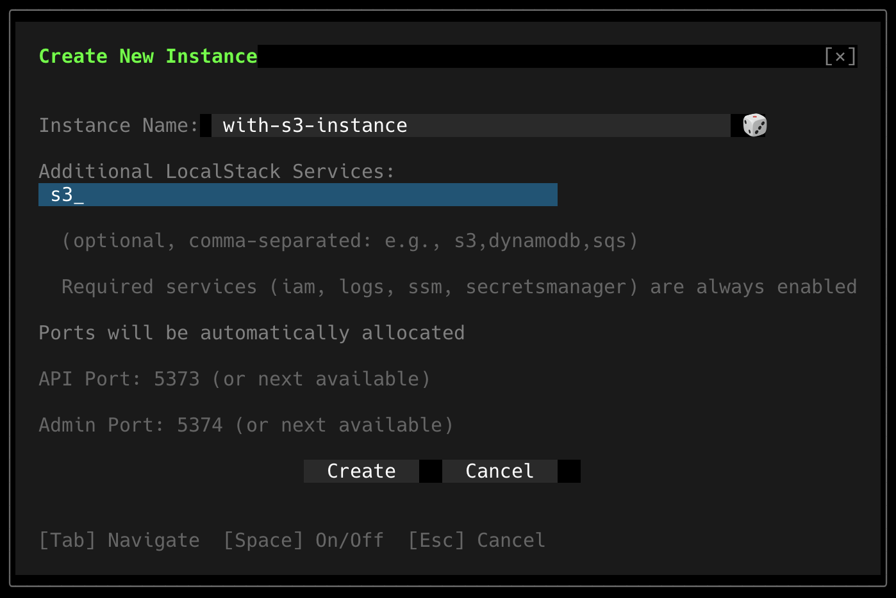

# LocalStack Integration Guide

KECS integrates with LocalStack to provide a complete local AWS environment. This guide covers setting up and using LocalStack with KECS.

## Overview

LocalStack integration enables:
- Local AWS service emulation (S3, DynamoDB, SQS, etc.)
- IAM role simulation
- CloudWatch logs and metrics
- Secrets Manager and SSM Parameter Store
- Service discovery with Route 53

## Configuring LocalStack Services

KECS automatically enables core AWS services required for ECS operations. You can also enable additional services based on your application needs.

### Default Services

KECS always enables these essential AWS services:

| Service | Purpose |
|---------|---------|
| **IAM** | Identity and Access Management for task roles |
| **CloudWatch Logs** | Container log aggregation and streaming |
| **SSM Parameter Store** | Configuration parameter storage |
| **Secrets Manager** | Secure secrets storage |
| **ELBv2** | Application and Network Load Balancers |
| **S3** | Object storage (included in defaults) |

These services are automatically available in every KECS instance without any configuration.

### Enabling Additional Services

For applications that need other AWS services, use the `--additional-localstack-services` flag when creating an instance:

**Via CLI:**
```bash
# Enable S3 and DynamoDB for data processing
kecs start --instance data-pipeline --additional-localstack-services s3,dynamodb

# Enable Lambda and SNS for serverless applications
kecs start --instance serverless --additional-localstack-services lambda,sns

# Enable multiple services
kecs start --instance full-stack \
  --additional-localstack-services dynamodb,sqs,sns,kinesis
```

**Via TUI (Interactive Mode):**

When using the TUI, you can configure LocalStack services through the instance creation dialog:



1. Launch the TUI: `tui`
2. Navigate to "Create New Instance" and press Enter
3. Fill in the instance name
4. In "Additional LocalStack Services" field, enter comma-separated service names
   - Example: `s3,dynamodb,sqs`
5. The UI shows helper text indicating which services are always enabled
6. Press Tab to navigate to "Create" button and press Enter

### Available Services

In addition to the default services, you can enable:

**Data Storage:**
- `dynamodb` - NoSQL database
- `rds` - Relational databases (MySQL, PostgreSQL)
- `elasticache` - In-memory caching (Redis, Memcached)

**Messaging & Streaming:**
- `sqs` - Simple Queue Service
- `sns` - Simple Notification Service
- `kinesis` - Real-time data streaming
- `kafka` - Managed streaming for Apache Kafka

**Serverless:**
- `lambda` - Serverless compute
- `stepfunctions` - Workflow orchestration
- `eventbridge` - Event bus

**Container & Compute:**
- `ec2` - Virtual machines
- `ecr` - Container registry

**Networking:**
- `apigateway` - API management
- `route53` - DNS service

For the complete list of supported services, see the [LocalStack Feature Coverage](https://docs.localstack.cloud/user-guide/aws/feature-coverage/) documentation.

### Common Configuration Patterns

**Microservices with Service Discovery:**
```bash
kecs start --instance microservices \
  --additional-localstack-services route53,servicediscovery
```

**Data Processing Pipeline:**
```bash
kecs start --instance data-pipeline \
  --additional-localstack-services s3,dynamodb,kinesis,lambda
```

**Event-Driven Architecture:**
```bash
kecs start --instance event-driven \
  --additional-localstack-services sqs,sns,eventbridge,lambda
```

**Full-Stack Web Application:**
```bash
kecs start --instance webapp \
  --additional-localstack-services dynamodb,s3,apigateway,lambda
```

### Verifying Enabled Services

Check which services are running in your LocalStack instance:

```bash
# Get the KECS endpoint
export AWS_ENDPOINT_URL=http://localhost:5373

# Check LocalStack health (shows all enabled services)
curl http://localhost:5373/_localstack/health | jq .
```

Expected output:
```json
{
  "services": {
    "iam": "running",
    "logs": "running",
    "ssm": "running",
    "secretsmanager": "running",
    "elbv2": "running",
    "s3": "running",
    "dynamodb": "running"  // if enabled via --additional-localstack-services
  }
}
```

## Using AWS Services

### IAM Integration

KECS automatically maps ECS task roles to Kubernetes ServiceAccounts:

```json
{
  "family": "webapp",
  "taskRoleArn": "arn:aws:iam::000000000000:role/webapp-task-role",
  "containerDefinitions": [
    {
      "name": "app",
      "image": "myapp:latest",
      "environment": [
        {
          "name": "AWS_REGION",
          "value": "us-east-1"
        }
      ]
    }
  ]
}
```

The container can now access AWS services using the task role.

### S3 Integration

Access S3 buckets from your containers without any endpoint configuration:

**Your Application Code** (same as production):
```python
import boto3

# No endpoint_url parameter needed!
# KECS automatically injects AWS_ENDPOINT_URL environment variable
s3 = boto3.client('s3')

# List buckets
buckets = s3.list_buckets()

# Upload file
s3.upload_file('local.txt', 'my-bucket', 'remote.txt')
```

**Task Definition** (no environment variables needed):
```json
{
  "family": "s3-app",
  "containerDefinitions": [
    {
      "name": "app",
      "image": "myapp:latest"
      // KECS automatically injects AWS_ENDPOINT_URL and credentials!
    }
  ]
}
```

### DynamoDB Integration

Use DynamoDB tables without any configuration:

**Your Application Code**:
```python
import boto3

# No endpoint configuration needed in code!
dynamodb = boto3.resource('dynamodb')
table = dynamodb.Table('users')

# Put item
table.put_item(Item={
    'userId': '123',
    'name': 'John Doe',
    'email': 'john@example.com'
})

# Query
response = table.get_item(Key={'userId': '123'})
```

**Task Definition** (clean and production-ready):
```json
{
  "family": "dynamodb-app",
  "containerDefinitions": [
    {
      "name": "app",
      "image": "myapp:latest"
      // No AWS_ENDPOINT_URL needed - KECS handles it automatically!
    }
  ]
}
```

### Secrets Manager

Store and retrieve secrets:

```bash
# Create secret via AWS CLI
aws secretsmanager create-secret \
  --name prod/db/password \
  --secret-string "mysecretpassword" \
  --endpoint-url http://localhost:5373

# Use in task definition
{
  "containerDefinitions": [
    {
      "name": "app",
      "secrets": [
        {
          "name": "DB_PASSWORD",
          "valueFrom": "arn:aws:secretsmanager:us-east-1:000000000000:secret:prod/db/password"
        }
      ]
    }
  ]
}
```

### SSM Parameter Store

Store configuration parameters:

```bash
# Create parameter
aws ssm put-parameter \
  --name /myapp/database/host \
  --value "db.example.com" \
  --type String \
  --endpoint-url http://localhost:5373

# Use in task definition
{
  "containerDefinitions": [
    {
      "name": "app",
      "secrets": [
        {
          "name": "DB_HOST",
          "valueFrom": "arn:aws:ssm:us-east-1:000000000000:parameter/myapp/database/host"
        }
      ]
    }
  ]
}
```

### CloudWatch Logs

Container logs are automatically sent to CloudWatch:

```json
{
  "containerDefinitions": [
    {
      "name": "app",
      "logConfiguration": {
        "logDriver": "awslogs",
        "options": {
          "awslogs-group": "/ecs/myapp",
          "awslogs-region": "us-east-1",
          "awslogs-stream-prefix": "webapp"
        }
      }
    }
  ]
}
```

View logs:
```bash
aws logs tail /ecs/myapp \
  --follow \
  --endpoint-url http://localhost:5373
```

## Automatic AWS Endpoint Configuration

KECS automatically configures AWS SDK environment variables for all ECS tasks, enabling seamless LocalStack integration **without requiring any endpoint configuration in your task definitions**. This mirrors the real AWS ECS experience where applications naturally access AWS services.

### How It Works

When you run an ECS task, KECS automatically:

1. **Detects ECS Tasks**: Identifies pods created from ECS task definitions
2. **Injects Environment Variables**: Adds AWS SDK configuration automatically:
   - `AWS_ENDPOINT_URL`: Points to LocalStack endpoint
   - `AWS_ACCESS_KEY_ID`: LocalStack test credentials
   - `AWS_SECRET_ACCESS_KEY`: LocalStack test credentials
   - `AWS_DEFAULT_REGION`: Configured region
   - `AWS_REGION`: Configured region

3. **SDK Auto-Configuration**: AWS SDK v2 automatically uses these environment variables

### Key Benefits

- **Zero Configuration**: No need to set AWS_ENDPOINT_URL in task definitions
- **Production-Ready Code**: Same task definitions work in both KECS and real AWS ECS
- **Automatic Detection**: Works for all ECS tasks without any annotations
- **No Code Changes**: Existing applications work without modifications

### Example: S3 Access Without Endpoint Configuration

**Task Definition** (no AWS_ENDPOINT_URL needed):
```json
{
  "family": "s3-processor",
  "containerDefinitions": [
    {
      "name": "worker",
      "image": "amazon/aws-cli:latest",
      "command": [
        "sh", "-c",
        "aws s3 mb s3://my-bucket && aws s3 ls"
      ]
    }
  ]
}
```

**What Happens:**
1. KECS webhook intercepts pod creation
2. Automatically injects AWS environment variables
3. AWS CLI uses `AWS_ENDPOINT_URL` to connect to LocalStack
4. S3 operations work seamlessly

### Comparison with Standard LocalStack Usage

**Without KECS** (requires manual configuration):
```json
{
  "containerDefinitions": [
    {
      "name": "app",
      "environment": [
        {
          "name": "AWS_ENDPOINT_URL",
          "value": "http://localstack:4566"
        },
        {
          "name": "AWS_ACCESS_KEY_ID",
          "value": "test"
        },
        {
          "name": "AWS_SECRET_ACCESS_KEY",
          "value": "test"
        }
      ]
    }
  ]
}
```

**With KECS** (completely automatic):
```json
{
  "containerDefinitions": [
    {
      "name": "app"
      // No environment variables needed!
    }
  ]
}
```

### How to Verify Auto-Configuration

Check that environment variables are injected:

```bash
# Get task ARN
TASK_ARN=$(aws ecs list-tasks --cluster default --endpoint-url http://localhost:5373 --query 'taskArns[0]' --output text)

# Extract task ID
TASK_ID=$(basename $TASK_ARN)

# Check environment variables in the pod
kubectl get pod $TASK_ID -n default-us-east-1 -o jsonpath='{.spec.containers[0].env[?(@.name=="AWS_ENDPOINT_URL")].value}'
```

You should see the LocalStack internal endpoint: `http://localstack.kecs-system.svc.cluster.local:4566`

## Service Discovery

### Private DNS Namespace

Create a Route 53 private hosted zone:

```bash
aws servicediscovery create-private-dns-namespace \
  --name prod.local \
  --vpc vpc-12345 \
  --endpoint-url http://localhost:5373
```

### Register Service

```json
{
  "serviceName": "api",
  "serviceRegistries": [
    {
      "registryArn": "arn:aws:servicediscovery:us-east-1:000000000000:service/srv-12345",
      "containerName": "api",
      "containerPort": 8080
    }
  ]
}
```

### Discover Services

Services can discover each other:
```python
# In your application
api_endpoint = "http://api.prod.local:8080"
```

## Testing with LocalStack

### Unit Tests

```python
import unittest
import boto3
from moto import mock_s3

class TestS3Integration(unittest.TestCase):
    @mock_s3
    def test_upload_file(self):
        # Create bucket
        s3 = boto3.client('s3', endpoint_url='http://localhost:5373')
        s3.create_bucket(Bucket='test-bucket')
        
        # Upload file
        s3.upload_file('test.txt', 'test-bucket', 'uploaded.txt')
        
        # Verify
        objects = s3.list_objects(Bucket='test-bucket')
        assert len(objects['Contents']) == 1
```

### Integration Tests

```bash
# Start LocalStack and KECS
docker-compose up -d

# Run tests
pytest tests/integration/

# Clean up
docker-compose down
```

## Monitoring and Debugging

### LocalStack Dashboard

Access the LocalStack UI:
1. Open http://localhost:8080/localstack/dashboard
2. View:
   - Service health status
   - API call logs
   - Resource listings
   - Configuration

### Debugging AWS SDK Calls

Enable debug logging:

```python
import logging
import boto3

# Enable debug logging
boto3.set_stream_logger('boto3.resources', logging.DEBUG)

# Your code here
s3 = boto3.client('s3')
```

### Viewing Proxy Logs

Check sidecar proxy logs:
```bash
kubectl logs <pod-name> -c localstack-proxy -n <namespace>
```

## Best Practices

### 1. Resource Initialization

Create resources on startup:

```python
# init_resources.py
import boto3

def initialize():
    s3 = boto3.client('s3', endpoint_url='http://localhost:5373')
    
    # Create buckets
    buckets = ['uploads', 'processed', 'archive']
    for bucket in buckets:
        try:
            s3.create_bucket(Bucket=bucket)
        except s3.exceptions.BucketAlreadyExists:
            pass
    
    # Create DynamoDB tables
    dynamodb = boto3.client('dynamodb', endpoint_url='http://localhost:5373')
    # ... create tables

if __name__ == '__main__':
    initialize()
```

### 2. Environment Parity

Keep local and production similar:
- Use same resource names
- Match IAM policies
- Replicate bucket structures
- Use consistent parameter paths
