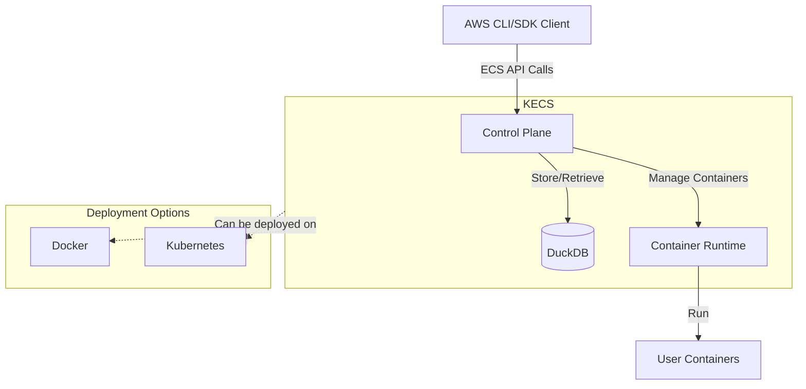
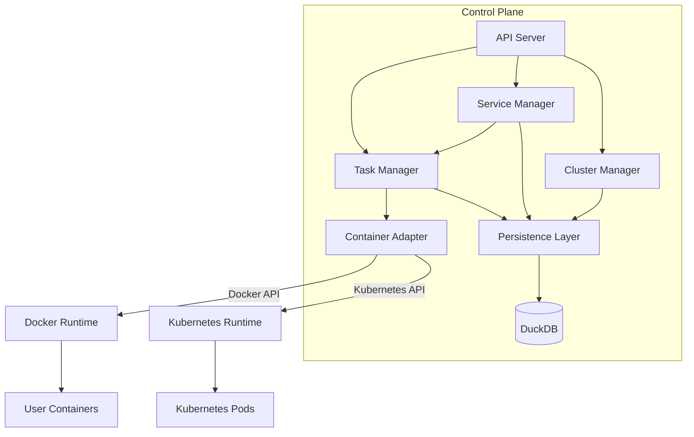
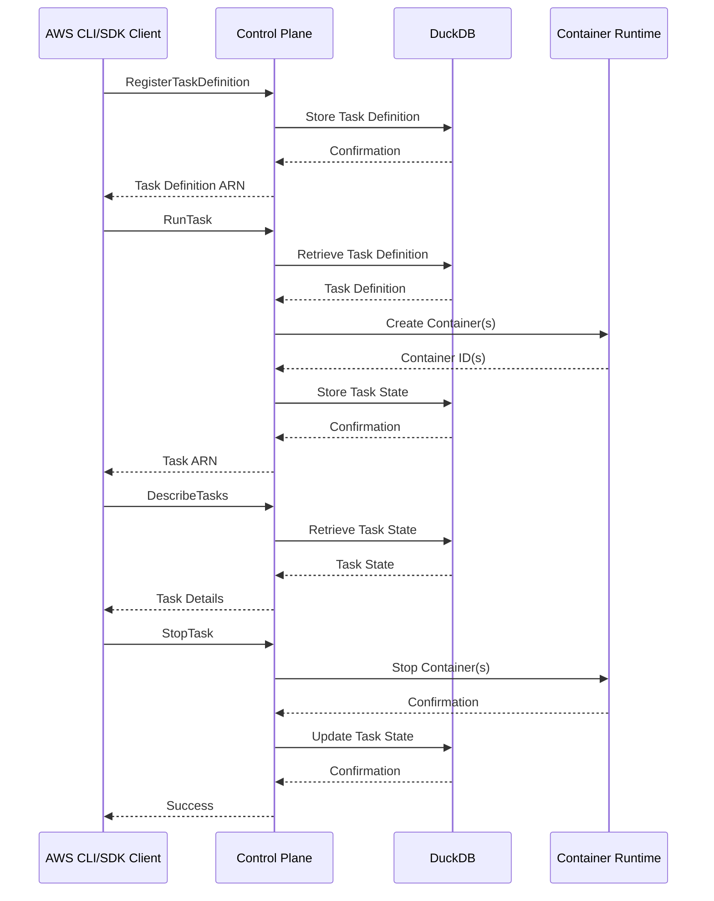
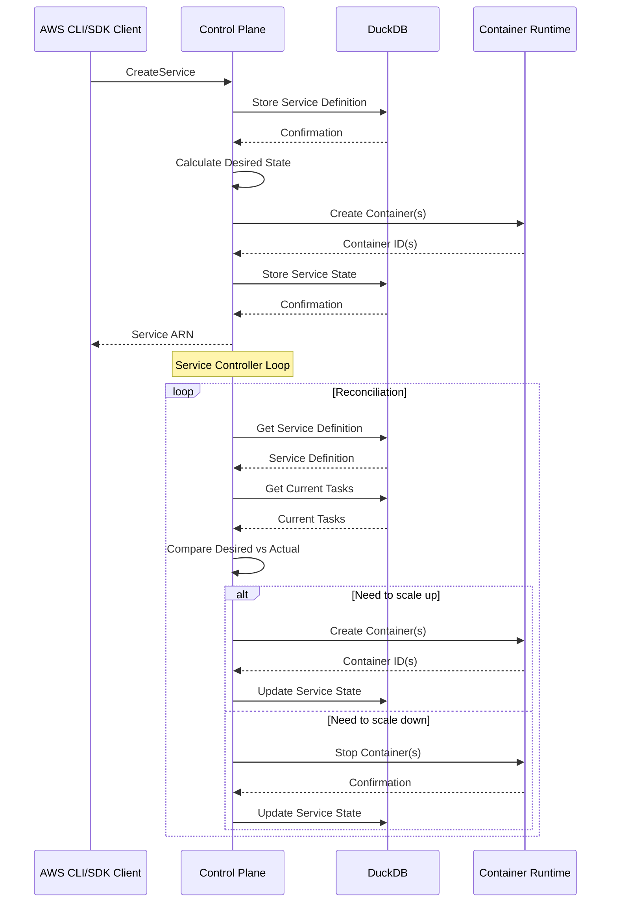

# Architecture

**Date:** 2025-05-14

## Status

Proposed

## Context

KECS (Kubernetes-based ECS Compatible Service) is a standalone service that provides Amazon ECS compatible APIs running on Kubernetes. This ADR describes the architectural design of KECS. KECS must meet the following requirements:

- Implemented as a standalone Go application
- Containerizable and runnable on both Docker and Kubernetes
- Provides Amazon ECS compatible API interfaces
- Contains an internal data store for persisting task definitions and service definitions
- Capable of starting and stopping containers based on definitions

## Decision

KECS will adopt the following architecture:

### Overall Architecture

### Component Structure

### Sequence Diagram (Task Execution Example)

### Sequence Diagram (Service Management Example)

## Consequences

### Benefits

- **AWS Compatibility**: KECS can be operated using AWS CLI and SDKs
- **Portability**: Can run on both Docker and Kubernetes
- **Standalone**: Minimal external dependencies, distributable as a single binary
- **Persistence**: Data can be persisted without external databases using DuckDB
- **Extensibility**: Support for different container runtimes through container adapters

### Challenges

- **Feature Limitations**: Not all ECS features will be supported
- **Performance**: Embedded DuckDB may become a bottleneck for large-scale workloads
- **Security**: Requires access permissions to container runtime

## Alternatives Considered

### Using External Databases

We considered using external databases (PostgreSQL, MySQL, etc.) instead of DuckDB, but chose embedded DuckDB for the following reasons:

- Simplified setup (no additional infrastructure required)
- Ability to distribute as a single binary
- Sufficient performance for small to medium workloads

### Serverless Architecture

We also considered architectures using serverless technologies like AWS Lambda, but rejected them for the following reasons:

- Dependency on AWS
- Complexity in local development environments
- Limited direct control over container management

## References

- [Amazon ECS API Reference](https://docs.aws.amazon.com/AmazonECS/latest/APIReference/Welcome.html)
- [DuckDB Documentation](https://duckdb.org/docs/)
- [Kubernetes API](https://kubernetes.io/docs/reference/kubernetes-api/)
