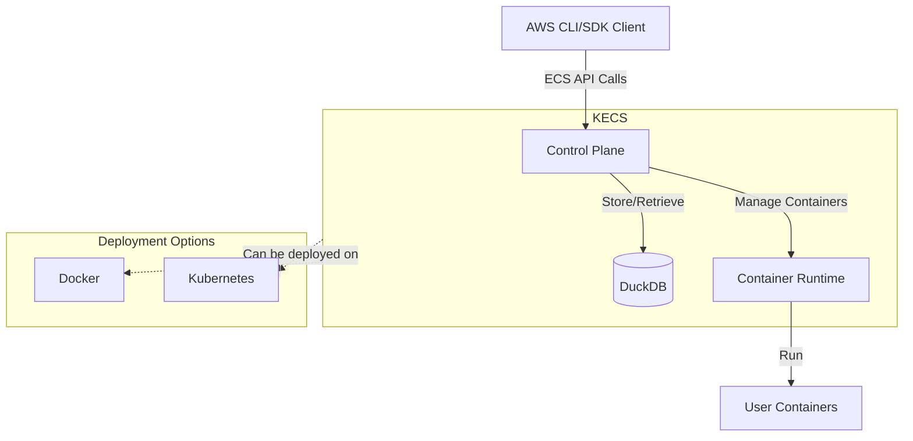
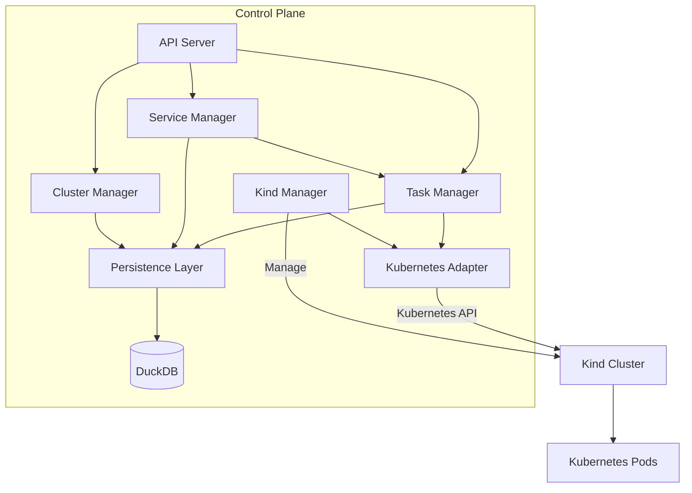
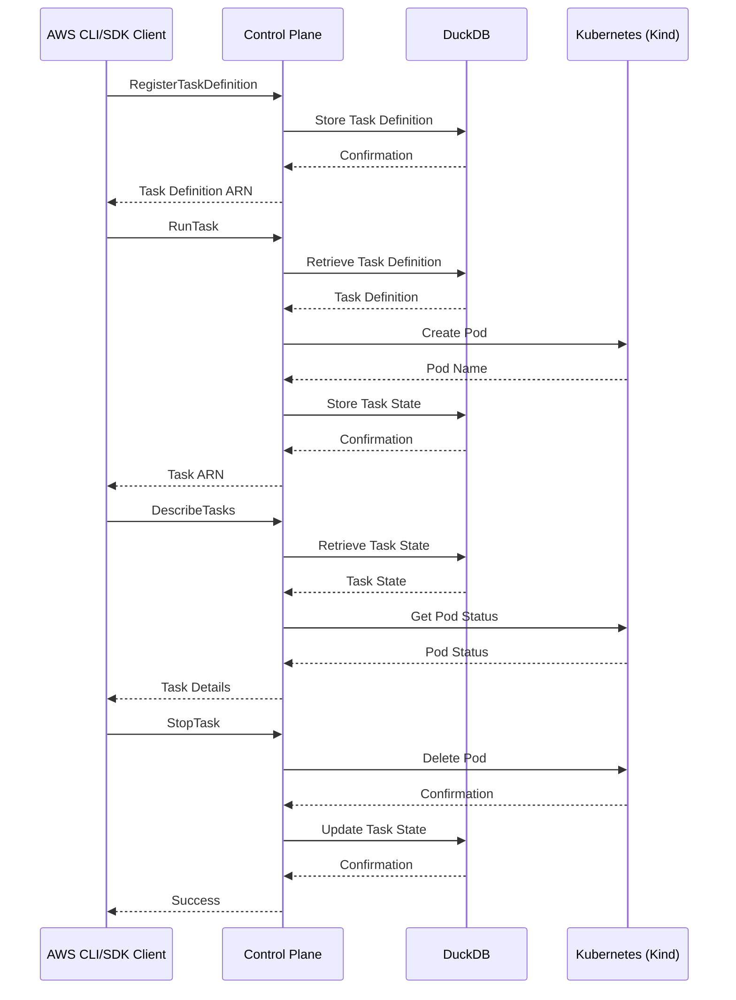
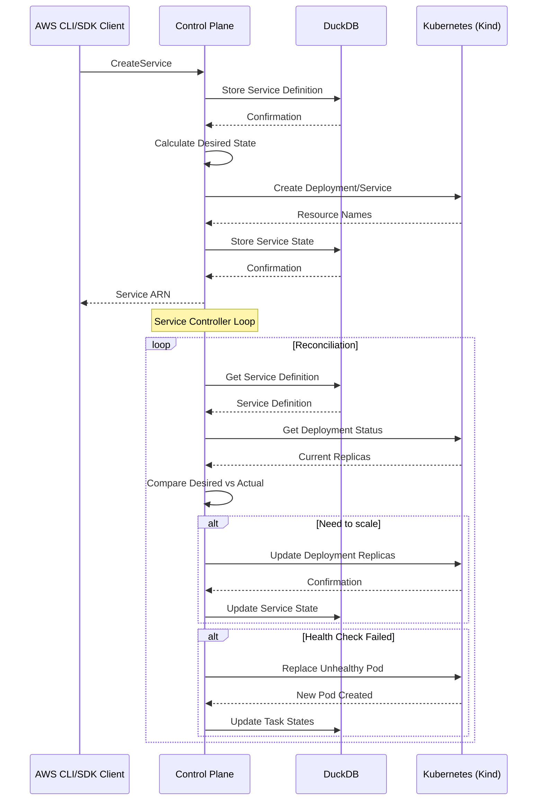

# Architecture

**Date:** 2025-05-14

## Status

Proposed

## Context

KECS (Kubernetes-based ECS Compatible Service) is a standalone service that provides Amazon ECS compatible APIs running on Kubernetes. This ADR describes the architectural design of KECS. KECS must meet the following requirements:

- Implemented as a standalone Go application
- Containerizable and runnable on both Docker and Kubernetes
- Provides Amazon ECS compatible API interfaces
- Contains an internal data store for persisting task definitions and service definitions
- Capable of starting and stopping containers based on definitions

## Decision

KECS will adopt the following architecture:

### Container Runtime Decision

KECS will use **Kubernetes (via kind)** as the exclusive container runtime for the following reasons:

1. **Service Management**: Kubernetes Services naturally map to ECS Services, providing built-in load balancing
2. **Health Checks**: Kubernetes probes (liveness/readiness) align with ECS health check mechanisms
3. **Auto-scaling**: Horizontal Pod Autoscaler (HPA) can implement ECS Service Auto Scaling
4. **Service Discovery**: CoreDNS provides service discovery equivalent to ECS Service Discovery
5. **Deployment Strategies**: Kubernetes supports rolling updates and other deployment patterns similar to ECS

KECS will embed and manage kind clusters to provide a complete, self-contained solution.

### Overall Architecture

### Component Structure

### Sequence Diagram (Task Execution Example)

### Sequence Diagram (Service Management Example)

## Consequences

### Benefits

- **AWS Compatibility**: KECS can be operated using AWS CLI and SDKs
- **Production-Grade Features**: Leverages Kubernetes' built-in capabilities for load balancing, health checks, auto-scaling, and service discovery
- **Standalone**: Minimal external dependencies, distributable as a single binary with embedded kind
- **Persistence**: Data can be persisted without external databases using DuckDB
- **Local Development**: kind provides a lightweight, local Kubernetes environment perfect for development and testing

### Challenges

- **Feature Limitations**: Not all ECS features will be supported
- **Performance**: Embedded DuckDB may become a bottleneck for large-scale workloads
- **Kubernetes Dependency**: Requires Kubernetes knowledge for debugging and advanced configurations
- **Resource Usage**: kind clusters consume more resources than direct Docker containers

## Alternatives Considered

### Using External Databases

We considered using external databases (PostgreSQL, MySQL, etc.) instead of DuckDB, but chose embedded DuckDB for the following reasons:

- Simplified setup (no additional infrastructure required)
- Ability to distribute as a single binary
- Sufficient performance for small to medium workloads

### Serverless Architecture

We also considered architectures using serverless technologies like AWS Lambda, but rejected them for the following reasons:

- Dependency on AWS
- Complexity in local development environments
- Limited direct control over container management

### Docker-only Runtime

We considered using Docker directly as the container runtime but chose Kubernetes for the following reasons:

- Docker alone lacks built-in service discovery and load balancing
- Would require implementing health checks, auto-scaling, and deployment strategies from scratch
- Kubernetes provides these features out-of-the-box, allowing KECS to focus on ECS API compatibility

## References

- [Amazon ECS API Reference](https://docs.aws.amazon.com/AmazonECS/latest/APIReference/Welcome.html)
- [DuckDB Documentation](https://duckdb.org/docs/)
- [Kubernetes API](https://kubernetes.io/docs/reference/kubernetes-api/)
