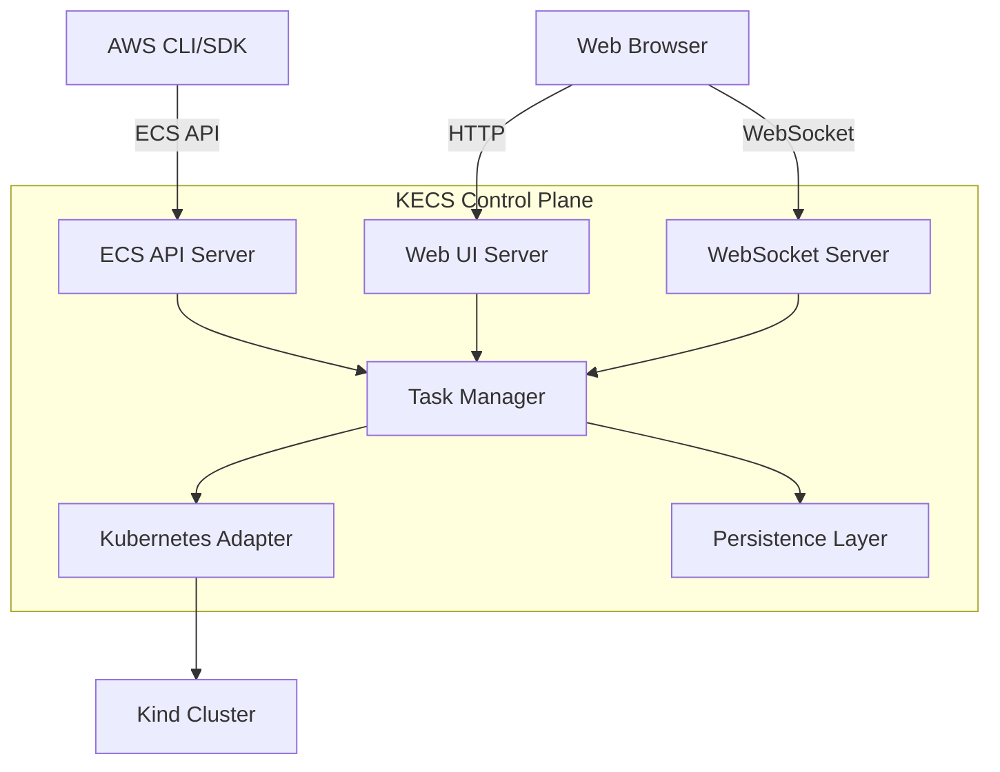

# ADR-0005: Web UI Integration

**Date:** 2025-06-01

## Status

Superseded by ADR-0016

## Superseding Note

This ADR has been superseded by ADR-0016 (Web UI Deprecation and TUI Adoption). The decision to implement a React-based Web UI has been reversed in favor of a Terminal User Interface (TUI) built with Bubbletea. The TUI approach better aligns with KECS's target audience and reduces maintenance complexity by keeping the entire codebase in Go.

For details on the new approach, see [ADR-0016](./0016-web-ui-deprecation-and-tui-adoption.md).

## Context

KECS (Kubernetes-based ECS Compatible Service) currently provides ECS-compatible APIs through a REST interface that can be accessed via AWS CLI and SDKs. While this approach serves the primary use case of API compatibility, developers working with KECS in local development and CI environments would benefit from a visual interface for monitoring, debugging, and managing their containerized applications.

The target users (software developers, DevOps engineers, and QA engineers) often need to:

1. Monitor running containers and services in real-time
2. Debug failed tasks and understand error conditions
3. Visualize service relationships and traffic flow
4. View logs from both KECS itself and user containers
5. Perform common operations without switching to command-line tools

Given that KECS is designed for local development and CI environments (not production), the Web UI should prioritize developer experience and debugging capabilities over enterprise features like authentication or audit trails.

## Decision

We will integrate a Web UI component (kecs-ui) directly into the KECS repository and application. The Web UI will be served by the KECS control plane alongside the ECS-compatible API endpoints.

### Core Features (Phase 1)

#### Log Viewer
- **KECS System Logs**: Display logs from the KECS control plane components
- **Container Logs**: Stream logs from user containers running in the Kubernetes cluster
- **Log Filtering**: Filter by log level, time range, and container/service
- **Real-time Streaming**: WebSocket-based real-time log updates

#### Container and Service Visualization
- **Service Topology**: Visual representation of ECS Services and their relationship to Tasks
- **Load Balancing Visualization**: Show how traffic is distributed across containers within a service
- **Container States**: Real-time status display (running, pending, stopped, failed)
- **Resource Usage**: CPU and memory usage visualization per container

#### Management Interface
- **Cluster Management**: View and manage ECS clusters
- **Service Operations**: Start, stop, scale, and restart services
- **Task Definition Management**: Create, edit, and version task definitions
- **Task Operations**: View running tasks, stop individual tasks

#### Real-time Monitoring
- **Resource Dashboard**: CPU, memory, and network usage metrics
- **Health Check Status**: Display Kubernetes probe results in ECS terms
- **Event Timeline**: Task lifecycle events (start, stop, health changes)
- **Error Diagnostics**: Detailed error information for failed tasks with troubleshooting hints

### Technical Implementation

#### Frontend Technology Stack
- **React with TypeScript**: For type safety and maintainable UI code
- **Recharts**: For metrics visualization and dashboards
- **React Flow**: For service topology and container relationship diagrams
- **WebSocket Client**: For real-time log streaming and status updates

#### Backend Integration
- **Embedded Static Files**: Web UI assets will be embedded in the KECS binary
- **Additional API Endpoints**: Extend the control plane with UI-specific endpoints
- **WebSocket Server**: Real-time communication for logs and status updates

```go
// HTTP routing structure
// /api/v1/*           - ECS-compatible API endpoints
// /ui/*               - Web UI static assets
// /ws/*               - WebSocket endpoints for real-time features
// /ui-api/*           - UI-specific API endpoints (metrics, logs, etc.)
```

#### Architecture Integration



### Deferred Features (Future Consideration)

#### Development Efficiency Features
- **Configuration Validator**: Pre-validation of Task Definitions and Service configurations
- **Resource Usage Reports**: Analysis of Kubernetes resource efficiency
- **Configuration Templates**: Quick-start templates for common use cases
- **Settings Comparison**: Diff view for configuration changes

#### CI/CD Integration Features
- **Test Result Summary**: Aggregated view of test execution results
- **Resource Efficiency Reports**: CI resource usage analysis
- **Configuration Export/Import**: Backup and restore of working configurations

#### Developer Experience Enhancements
- **Integrated API Documentation**: Embedded Swagger UI for ECS API
- **JSON/YAML Editor**: Syntax-highlighted editors for configurations
- **One-click Operations**: Bulk operations like "stop all tasks" or "restart service"

## Consequences

### Positive Outcomes

- **Improved Developer Experience**: Visual interface reduces context switching between tools
- **Faster Debugging**: Real-time logs and visual service topology speed up problem diagnosis
- **Better Understanding**: Service visualization helps developers understand ECS concepts
- **Reduced Learning Curve**: GUI interface makes KECS more accessible to developers new to ECS
- **Self-contained Solution**: Everything needed for development is in one application

### Challenges and Trade-offs

- **Increased Binary Size**: Embedding Web UI assets will increase the KECS binary size
- **Additional Complexity**: Web UI adds another component to maintain and test
- **Resource Usage**: Web UI server and WebSocket connections consume additional memory
- **Browser Dependencies**: Requires a web browser for the visual interface
- **Development Overhead**: Need to maintain both API and UI codebases

### Risk Mitigation

- **Optional UI**: The Web UI will be optional and can be disabled via configuration
- **Embedded Assets**: Using go:embed to include assets reduces deployment complexity
- **Progressive Enhancement**: Core KECS functionality remains accessible via API even if UI fails

## Implementation Plan

### Phase 1: Core UI (3 months)
1. Set up React TypeScript project in `web-ui/` directory
2. Implement basic log viewer with WebSocket streaming
3. Create service and container visualization
4. Add basic management operations (start/stop services and tasks)
5. Integrate static asset serving into KECS control plane

### Phase 2: Enhanced Monitoring (2 months)
1. Add real-time resource monitoring dashboard
2. Implement health check status visualization
3. Create event timeline and error diagnostics
4. Add log filtering and search capabilities

### Testing Strategy
- **Unit Tests**: Test UI components with React Testing Library
- **Integration Tests**: Test WebSocket communication and API integration
- **E2E Tests**: Use TestContainers to test complete UI workflows against running KECS instances

## Alternatives Considered

### Separate Web UI Service
- **Pros**: Clean separation of concerns, independent deployment
- **Cons**: Additional operational complexity, network configuration requirements
- **Rejected**: Goes against KECS's goal of being a self-contained development tool

### CLI-only with TUI
- **Pros**: No browser dependency, lightweight
- **Cons**: Limited visualization capabilities, less intuitive for complex service topologies
- **Rejected**: Visual representation of service relationships is crucial for understanding ECS concepts

### External Monitoring Tools (Prometheus + Grafana)
- **Pros**: Industry-standard tools, rich ecosystem
- **Cons**: Additional infrastructure requirements, setup complexity
- **Rejected**: Adds dependencies and complexity that conflict with KECS's standalone nature

## References

- [React Documentation](https://react.dev/)
- [Recharts Documentation](https://recharts.org/)
- [React Flow Documentation](https://reactflow.dev/)
- [Go embed Package](https://pkg.go.dev/embed)
- [WebSocket API](https://developer.mozilla.org/en-US/docs/Web/API/WebSockets_API)