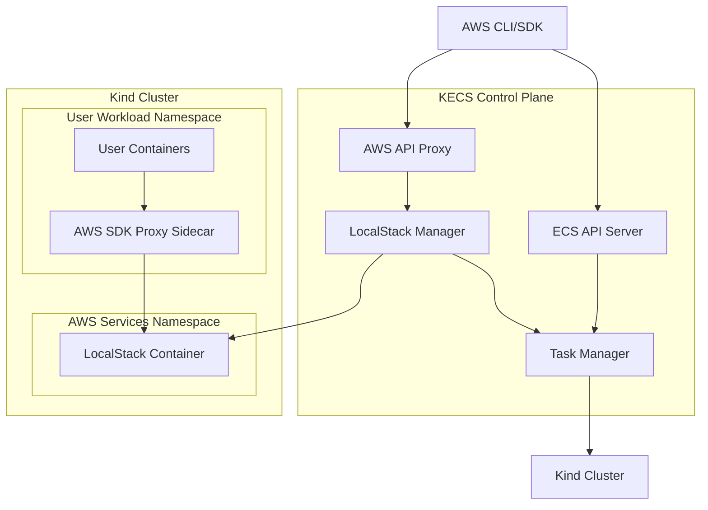

# ADR-0012: LocalStack Integration for AWS Service Emulation

**Date:** 2025-06-14

## Status

In Progress

## Context

KECS currently provides Amazon ECS-compatible APIs running on Kubernetes, but real ECS workloads often integrate with other AWS services like:
- Application Load Balancer (ALB) / Network Load Balancer (NLB)
- IAM roles and policies
- CloudWatch for logging and metrics
- Systems Manager for parameter storage
- Secrets Manager for sensitive data
- S3 for artifact storage
- RDS for database services

To provide a comprehensive local development environment that mirrors production AWS environments, KECS needs to support these additional AWS services. LocalStack provides local implementations of these services and is widely adopted in the AWS development community.

Unlike solutions like AWS SAM Local or Localstack standalone installations, KECS with LocalStack integration will provide a fully integrated, self-contained development environment that requires no external dependencies or manual setup.

## Decision

We will integrate LocalStack into KECS to provide a complete AWS-compatible local development environment with automatic lifecycle management and seamless connectivity.

### Architecture Overview



### Core Components

#### 1. LocalStack Lifecycle Management

```go
type LocalStackManager struct {
    cluster      string
    services     []string
    container    *LocalStackContainer
    kubeClient   kubernetes.Interface
}

type LocalStackConfig struct {
    Services    []string          `json:"services"`
    Environment map[string]string `json:"environment"`
    Persistence bool              `json:"persistence"`
    Port        int               `json:"port"`
}

func (lsm *LocalStackManager) StartLocalStack(config LocalStackConfig) error
func (lsm *LocalStackManager) UpdateServices(services []string) error
func (lsm *LocalStackManager) GetEndpoint() (string, error)
func (lsm *LocalStackManager) IsHealthy() bool
```

#### 2. AWS API Proxy

KECS will expose AWS API endpoints and route them appropriately:

```go
// HTTP routing structure
// /api/v1/ecs/*        - ECS API (handled by KECS)
// /api/v1/iam/*        - IAM API (proxied to LocalStack)
// /api/v1/s3/*         - S3 API (proxied to LocalStack)
// /api/v1/logs/*       - CloudWatch Logs (proxied to LocalStack)
// /api/v1/ssm/*        - Systems Manager (proxied to LocalStack)
```

#### 3. Automatic Sidecar Injection

For seamless AWS SDK connectivity from user containers:

```yaml
apiVersion: v1
kind: Pod
metadata:
  annotations:
    kecs.io/inject-aws-proxy: "true"
spec:
  containers:
  - name: user-app
    image: my-app:latest
    env:
    - name: AWS_ENDPOINT_URL
      value: "http://localhost:4566"
  - name: aws-proxy-sidecar
    image: kecs/aws-proxy:latest
    ports:
    - containerPort: 4566
    env:
    - name: LOCALSTACK_ENDPOINT
      value: "http://localstack.aws-services.svc.cluster.local:4566"
```

### Implementation Details

#### LocalStack Container Deployment

```yaml
apiVersion: apps/v1
kind: Deployment
metadata:
  name: localstack
  namespace: aws-services
spec:
  replicas: 1
  selector:
    matchLabels:
      app: localstack
  template:
    metadata:
      labels:
        app: localstack
    spec:
      containers:
      - name: localstack
        image: localstack/localstack:latest
        ports:
        - containerPort: 4566
        env:
        - name: SERVICES
          value: "iam,s3,logs,ssm,secretsmanager,elbv2,rds"
        - name: DEBUG
          value: "1"
        - name: PERSISTENCE
          value: "1"
        volumeMounts:
        - name: localstack-data
          mountPath: /var/lib/localstack
      volumes:
      - name: localstack-data
        persistentVolumeClaim:
          claimName: localstack-data
---
apiVersion: v1
kind: Service
metadata:
  name: localstack
  namespace: aws-services
spec:
  selector:
    app: localstack
  ports:
  - port: 4566
    targetPort: 4566
```

#### Sidecar Proxy Implementation

```go
type AWSProxyServer struct {
    localstackEndpoint string
    client            *http.Client
}

func (p *AWSProxyServer) ServeHTTP(w http.ResponseWriter, r *http.Request) {
    // Modify request to point to LocalStack
    targetURL := p.localstackEndpoint + r.URL.Path
    
    // Create proxy request
    proxyReq, err := http.NewRequest(r.Method, targetURL, r.Body)
    if err != nil {
        http.Error(w, err.Error(), http.StatusInternalServerError)
        return
    }
    
    // Copy headers
    for name, values := range r.Header {
        for _, value := range values {
            proxyReq.Header.Add(name, value)
        }
    }
    
    // Forward to LocalStack
    resp, err := p.client.Do(proxyReq)
    if err != nil {
        http.Error(w, err.Error(), http.StatusBadGateway)
        return
    }
    defer resp.Body.Close()
    
    // Copy response
    for name, values := range resp.Header {
        for _, value := range values {
            w.Header().Add(name, value)
        }
    }
    w.WriteHeader(resp.StatusCode)
    io.Copy(w, resp.Body)
}
```

### Configuration Options

#### Cluster-Level Configuration

```yaml
# kecs-config.yaml
clusters:
  - name: default
    localstack:
      enabled: true
      version: "4.5"  # LocalStack version (default: latest)
      services:
        - iam
        - s3
        - logs
        - ssm
        - secretsmanager
        - elbv2
      persistence: true
      customConfig:
        S3_SKIP_SIGNATURE_VALIDATION: "1"
        IAM_LOAD_MANAGED_POLICIES: "1"
```

#### Runtime Service Management

```bash
# Enable additional services
kecs localstack enable --services rds,dynamodb

# Disable services
kecs localstack disable --services rds

# Get status
kecs localstack status

# Restart with new configuration
kecs localstack restart
```

### ECS Integration Enhancements

#### Secrets Integration (SSM & Secrets Manager)

```go
type SecretsIntegration struct {
    ssmClient         *ssm.Client
    secretsClient     *secretsmanager.Client
    k8sClient        kubernetes.Interface
}

func (si *SecretsIntegration) SyncSecrets(taskDef *TaskDefinition) error {
    // Extract secrets from container definitions
    for _, container := range taskDef.ContainerDefinitions {
        for _, secret := range container.Secrets {
            // Parse ARN to determine source (SSM or Secrets Manager)
            // Fetch secret value from LocalStack
            // Create/update Kubernetes Secret
        }
    }
}

func (si *SecretsIntegration) CreateK8sSecret(name, namespace string, data map[string][]byte) error {
    // Create Kubernetes secret that can be referenced by pods
}
```

#### Load Balancer Integration

*Note: ELBv2 integration has been implemented using Kubernetes native Services and Ingress resources to avoid LocalStack Pro dependency. See `internal/integrations/elbv2/integration_k8s.go` for the virtual implementation.*

#### IAM Role Integration

```go
type IAMIntegration struct {
    localstackClient *iam.Client
    k8sClient       kubernetes.Interface
}

func (iam *IAMIntegration) CreateTaskRole(taskDef *TaskDefinition) error {
    // Create IAM role in LocalStack
    // Create corresponding ServiceAccount in Kubernetes
    // Map IAM policies to RBAC rules
}
```

### CLI Enhancements

```bash
# Create cluster with LocalStack
kecs create-cluster --name my-cluster --localstack-services iam,s3,logs

# Deploy service with ALB
aws ecs create-service \
  --cluster my-cluster \
  --service-name my-service \
  --task-definition my-task \
  --load-balancers targetGroupArn=arn:aws:elasticloadbalancing:us-east-1:000000000000:targetgroup/my-tg/123

# Access LocalStack services directly
aws s3 ls --endpoint-url http://localhost:4566
aws iam list-roles --endpoint-url http://localhost:4566
```

### Web UI Integration

Add LocalStack management to the Web UI:

```typescript
// LocalStack service status component
const LocalStackStatus: React.FC = () => {
  const [services, setServices] = useState<LocalStackService[]>([]);
  
  return (
    <div className="localstack-dashboard">
      <h3>AWS Services (LocalStack)</h3>
      <div className="services-grid">
        {services.map(service => (
          <ServiceCard 
            key={service.name}
            name={service.name}
            status={service.status}
            endpoint={service.endpoint}
          />
        ))}
      </div>
      <ServiceManagement onUpdate={updateServices} />
    </div>
  );
};
```

## Consequences

### Benefits

1. **Complete AWS Environment**: Developers can test with full AWS service integration locally
2. **Cost Reduction**: No AWS charges for development and testing
3. **Offline Development**: Works without internet connectivity to AWS
4. **Fast Iteration**: Quick setup and teardown of AWS resources
5. **Production Parity**: High fidelity to actual AWS behavior
6. **Educational Value**: Learn AWS services without production risks

### Challenges

1. **Resource Usage**: LocalStack adds significant memory and CPU overhead
2. **Complexity**: Additional components to manage and debug
3. **Feature Parity**: Some AWS features may not be fully implemented in LocalStack
4. **Network Configuration**: Complex networking setup for sidecar communication
5. **State Management**: Persistence and data consistency across restarts

### Risks

1. **LocalStack Compatibility**: KECS tied to LocalStack's feature support and bugs
2. **Performance**: Additional network hops through proxy sidecars
3. **Configuration Drift**: LocalStack behavior may differ from real AWS
4. **Debugging Complexity**: Multiple layers of abstraction can complicate troubleshooting

### Alternatives Considered

#### 1. AWS SDK Mocking
- **Pros**: Lightweight, no additional containers
- **Cons**: Limited to SDK-level testing, no infrastructure simulation
- **Rejected**: Doesn't provide full environment simulation

#### 2. External LocalStack Instance
- **Pros**: Simpler KECS implementation, user controls LocalStack
- **Cons**: Manual setup burden, configuration complexity
- **Rejected**: Goes against KECS's self-contained philosophy

#### 3. Custom AWS Service Implementations
- **Pros**: Full control over behavior and features
- **Cons**: Massive implementation effort, maintenance burden
- **Rejected**: LocalStack already provides mature implementations

## Implementation Plan

### Phase 1: Foundation (4 weeks) - COMPLETED
1. ✅ LocalStack lifecycle management in KECS
2. ✅ Basic AWS API proxy implementation
3. ✅ Simple sidecar proxy for user containers
4. ✅ CLI commands for LocalStack management

### Phase 2: Core Integrations (6 weeks)
1. ~~IAM role integration with ServiceAccounts~~ (Completed)
2. ~~Load balancer integration with Kubernetes Services~~ (Completed with Kubernetes native implementation)
3. ~~CloudWatch logs integration~~ (Completed)
4. ~~Basic S3 integration for task artifacts~~ (Completed)
5. ~~SSM Parameter Store integration for container secrets~~ (Completed)
6. ~~Secrets Manager integration for sensitive configuration~~ (Completed)

### Phase 3: Advanced Features (4 weeks)
1. Automatic sidecar injection
2. Web UI LocalStack dashboard
3. Service discovery integration
4. Advanced networking configurations

### Phase 4: Polish and Documentation (2 weeks)
1. Comprehensive testing with real applications
2. Performance optimization
3. Complete documentation and examples
4. Troubleshooting guides

## References

- [LocalStack Documentation](https://docs.localstack.cloud/)
- [AWS SDK Proxy Patterns](https://aws.amazon.com/blogs/developer/mocking-modular-aws-sdk-for-javascript-in-unit-tests/)
- [Kubernetes Sidecar Pattern](https://kubernetes.io/docs/concepts/workloads/pods/#workload-resources-for-managing-pods)
- [ADR-0002: Architecture](0002-architecture.md)
- [ADR-0007: ECS-Kubernetes Resource Mapping](0007-ecs-kubernetes-resource-mapping.md)