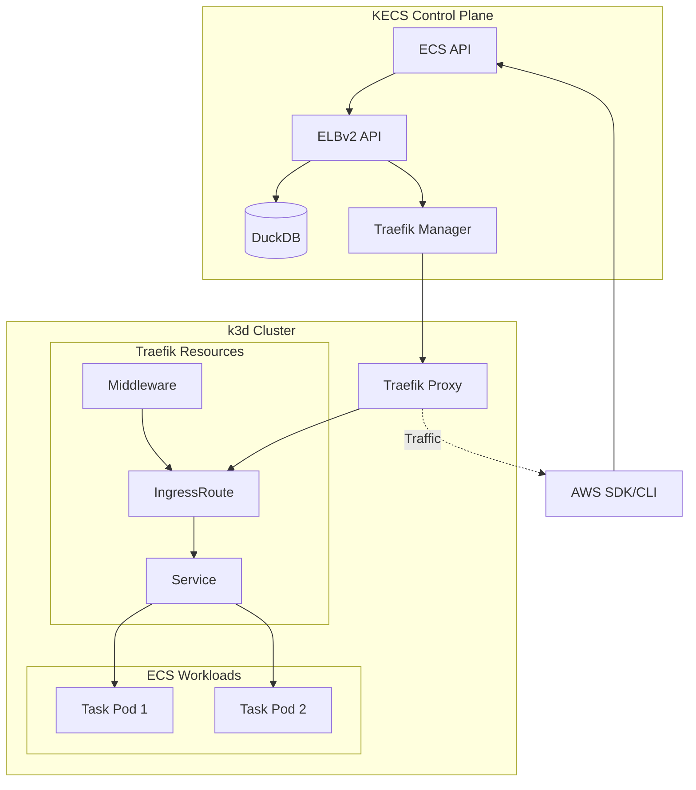

# ADR-0017: ELBv2 Implementation with Traefik

Date: 2025-07-14

## Status

Proposed

## Context

KECS needs to provide Amazon ELBv2 (Elastic Load Balancing v2) compatible APIs to support ECS services that use Application Load Balancers (ALB) and Network Load Balancers (NLB). The current implementation provides only virtual resources that don't actually route traffic.

### Current State

1. **Virtual Implementation**: The existing ELBv2 integration (`internal/integrations/elbv2/integration_k8s.go`) provides:
   - In-memory storage of virtual load balancers, target groups, and listeners
   - Simulated health check transitions
   - No actual traffic routing capabilities
   - No persistence of resources

2. **AWS Workflow Requirements**:
   - AWS requires creating ELB resources before they can be referenced
   - Services reference target groups by ARN
   - Health checks and target registration are essential features
   - DNS names must be provided for load balancer access

3. **KECS Architecture**:
   - Uses Kubernetes Services as the underlying load balancing mechanism
   - Traefik is already integrated for LocalStack proxy functionality
   - k3d clusters with dynamic port allocation

### Technology Comparison

We evaluated three load balancer technologies:

| Feature | Envoy | Traefik | HAProxy |
|---------|--------|----------|----------|
| Kubernetes Native | Yes (via Contour/Istio) | Yes (CRDs) | Limited |
| Dynamic Configuration | Yes | Yes | Limited |
| Learning Curve | High | Medium | Low |
| Resource Usage | High | Low | Very Low |
| AWS ALB Features | Extensive | Good | Basic |
| Already in KECS | No | **Yes** | No |

## Decision

We will use **Traefik** as the base technology for implementing ELBv2 functionality in KECS.

### Rationale

1. **Already Integrated**: Traefik is already deployed in KECS for LocalStack proxy functionality
2. **Kubernetes Native**: Supports Custom Resource Definitions (CRDs) for dynamic configuration
3. **Lightweight**: Low resource overhead compared to Envoy
4. **Dynamic Updates**: Can update routing rules without restart
5. **Feature Set**: Supports path-based routing, host-based routing, and load balancing algorithms
6. **Code Reuse**: Can leverage existing `TraefikManager` implementation

### Implementation Approach

#### Phase 1: ELBv2 API Endpoints (2 weeks)

Add actual ELBv2 API endpoints to handle AWS SDK/CLI requests:

```go
// internal/controlplane/api/elbv2_api.go
type ELBv2API struct {
    storage      storage.ELBv2Store
    k8sManager   kubernetes.Manager
    traefikMgr   *kubernetes.TraefikManager
}

func (api *ELBv2API) CreateLoadBalancer(ctx context.Context, req *CreateLoadBalancerInput) (*CreateLoadBalancerOutput, error)
func (api *ELBv2API) CreateTargetGroup(ctx context.Context, req *CreateTargetGroupInput) (*CreateTargetGroupOutput, error)
func (api *ELBv2API) CreateListener(ctx context.Context, req *CreateListenerInput) (*CreateListenerOutput, error)
func (api *ELBv2API) RegisterTargets(ctx context.Context, req *RegisterTargetsInput) (*RegisterTargetsOutput, error)
```

Storage layer using DuckDB:
```sql
CREATE TABLE load_balancers (
    arn TEXT PRIMARY KEY,
    name TEXT NOT NULL,
    dns_name TEXT,
    scheme TEXT,
    state TEXT,
    created_at TIMESTAMP
);

CREATE TABLE target_groups (
    arn TEXT PRIMARY KEY,
    name TEXT NOT NULL,
    port INTEGER,
    protocol TEXT,
    vpc_id TEXT,
    health_check_path TEXT,
    created_at TIMESTAMP
);
```

#### Phase 2: Traefik Integration (3 weeks)

Map ELBv2 resources to Traefik configurations:

1. **Load Balancer → Traefik Entrypoint + Router**
   ```yaml
   apiVersion: traefik.io/v1alpha1
   kind: IngressRoute
   metadata:
     name: alb-{load-balancer-name}
   spec:
     entryPoints:
       - web
     routes:
       - match: Host(`{dns-name}`)
         kind: Rule
         services:
           - name: {target-group-service}
             port: {port}
   ```

2. **Target Group → Kubernetes Service**
   ```yaml
   apiVersion: v1
   kind: Service
   metadata:
     name: tg-{target-group-name}
     labels:
       kecs.io/target-group: {arn}
   spec:
     selector:
       kecs.io/target-group: {arn}
     ports:
       - port: {port}
         targetPort: {container-port}
   ```

3. **Target Registration → Endpoint Management**
   - Update Service endpoints when targets are registered/deregistered
   - Implement health check monitoring using Traefik health checks

4. **Listener Rules → Traefik Middleware**
   ```yaml
   apiVersion: traefik.io/v1alpha1
   kind: Middleware
   metadata:
     name: listener-{listener-arn}
   spec:
     headers:
       customRequestHeaders:
         X-Forwarded-For: {sourceIP}
   ```

#### Phase 3: DNS and Discovery (Optional, 2 weeks)

1. **DNS Resolution**:
   - Generate predictable DNS names: `{lb-name}-{hash}.{region}.elb.kecs.local`
   - Integrate with CoreDNS in k3d cluster
   - Map to Traefik service endpoints

2. **Service Discovery**:
   - Automatic target discovery from ECS services
   - Dynamic target registration/deregistration

### Architecture



## Consequences

### Positive

1. **Real Load Balancing**: Actual traffic routing instead of virtual resources
2. **Persistence**: Resources stored in DuckDB survive restarts
3. **AWS Compatibility**: Supports standard AWS workflows
4. **Production-Like**: More realistic testing environment
5. **Leverage Existing Code**: Reuses Traefik integration
6. **Extensibility**: Easy to add more ALB features

### Negative

1. **Complexity**: More moving parts than virtual implementation
2. **Resource Usage**: Traefik adds overhead (though minimal)
3. **Feature Gaps**: Some advanced ALB features may be hard to implement
4. **DNS Challenges**: Local DNS resolution requires additional setup

### Trade-offs

1. **Completeness vs Simplicity**: We're adding complexity for better AWS compatibility
2. **Performance vs Features**: Real proxy adds latency but provides actual routing
3. **Maintenance**: More code to maintain but better user experience

## Implementation Notes

1. **Backward Compatibility**: Keep virtual implementation as fallback
2. **Feature Flags**: Allow users to choose between virtual and Traefik-based implementation
3. **Migration Path**: Provide tools to migrate from virtual to real resources
4. **Documentation**: Clear guides on capabilities and limitations

## Future Enhancements

1. **SSL/TLS Support**: Use cert-manager for certificate management
2. **WAF Integration**: Add basic WAF rules using Traefik middleware
3. **Monitoring**: Integrate with Prometheus for metrics
4. **Advanced Routing**: Support for weighted target groups
5. **NLB Support**: Extend to Network Load Balancers using Traefik TCP

## References

- [ADR-0007: ECS-Kubernetes Resource Mapping](./0007-ecs-kubernetes-resource-mapping.md)
- [ADR-0012: LocalStack Integration](./0012-kecs-localstack-adr.md)
- [ADR-0014: k3d Migration](./0014-k3d-migration.md)
- [Traefik Documentation](https://doc.traefik.io/traefik/)
- [AWS ELBv2 Documentation](https://docs.aws.amazon.com/elasticloadbalancing/latest/application/)
- `/controlplane/docs/elbv2-integration.md` - Current virtual implementation
- `/controlplane/internal/kubernetes/traefik_manager.go` - Existing Traefik integration