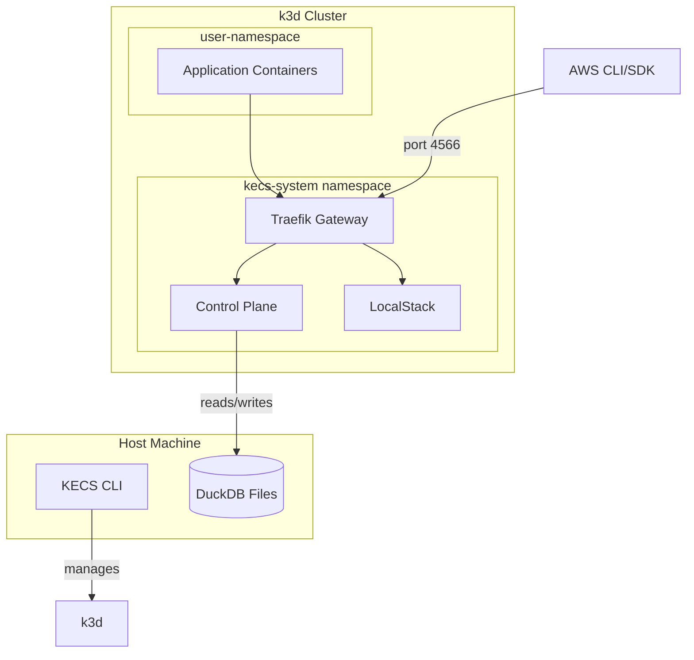

# ADR-0018: Control Plane in k3d Cluster Architecture

## Status

Proposed

## Context

The current KECS architecture runs the control plane as a standalone process (either in a container or directly on the host) that manages k3d clusters. This design has revealed a significant limitation:

**Problem**: Application containers running inside KECS clusters cannot access KECS control plane APIs (ECS, ELBv2) while they can access LocalStack APIs. This is because:
- LocalStack runs inside the k3d cluster (in `kecs-system` namespace)
- KECS control plane runs outside the k3d cluster
- Applications that need to call ECS APIs from within containers face networking complexity

This limitation prevents certain use cases:
- Applications that manage ECS resources dynamically
- Self-scaling applications that interact with ECS APIs
- Testing scenarios where containers need to create/modify ECS resources

## Decision

We will redesign KECS architecture to run the control plane inside the k3d cluster, providing a unified AWS API endpoint accessible from all containers within the cluster.

### New Architecture Overview



### Key Changes

1. **CLI Role Change**
   - From: Running persistent control plane process
   - To: k3d cluster lifecycle manager only
   - No longer needs to run continuously

2. **Control Plane Deployment**
   - Runs as Kubernetes Deployment in `kecs-system` namespace
   - Containerized with proper health checks
   - Co-located with LocalStack and Traefik

3. **Unified API Gateway**
   - Traefik routes AWS API requests:
     - ECS/ELBv2 APIs → Control Plane
     - Other AWS APIs → LocalStack
   - Single endpoint (port 4566) for all AWS services

4. **Data Persistence**
   - DuckDB files remain on host filesystem
   - Mounted into control plane pods via k3d volumes
   - Enables cluster recreation with state preservation

### Implementation Details

#### k3d Cluster Creation
```bash
k3d cluster create kecs \
  --api-port 6550 \
  --port "4566:4566@loadbalancer" \
  --volume "$HOME/.kecs/data:/data" \
  --k3s-arg "--disable=traefik@server:0"
```

#### Control Plane Kubernetes Resources
```yaml
apiVersion: v1
kind: Namespace
metadata:
  name: kecs-system
---
apiVersion: apps/v1
kind: Deployment
metadata:
  name: kecs-control-plane
  namespace: kecs-system
spec:
  replicas: 1
  selector:
    matchLabels:
      app: kecs-control-plane
  template:
    metadata:
      labels:
        app: kecs-control-plane
    spec:
      containers:
      - name: control-plane
        image: ghcr.io/nandemo-ya/kecs-control-plane:latest
        ports:
        - name: api
          containerPort: 8080
        - name: admin
          containerPort: 8081
        env:
        - name: KECS_DATA_DIR
          value: /data
        - name: KECS_CONTAINER_MODE
          value: "true"
        volumeMounts:
        - name: data
          mountPath: /data
        livenessProbe:
          httpGet:
            path: /health
            port: admin
        readinessProbe:
          httpGet:
            path: /ready
            port: admin
      volumes:
      - name: data
        hostPath:
          path: /data
          type: Directory
---
apiVersion: v1
kind: Service
metadata:
  name: kecs-control-plane
  namespace: kecs-system
spec:
  selector:
    app: kecs-control-plane
  ports:
  - name: api
    port: 8080
    targetPort: api
  - name: admin
    port: 8081
    targetPort: admin
```

#### Traefik Routing Configuration
```yaml
apiVersion: traefik.containo.us/v1alpha1
kind: IngressRoute
metadata:
  name: aws-api-router
  namespace: kecs-system
spec:
  entryPoints:
  - web
  routes:
  # Route ECS APIs to KECS
  - match: PathPrefix(`/`) && Headers(`X-Amz-Target`, `~^AmazonEC2ContainerServiceV[0-9]+\.`)
    kind: Rule
    services:
    - name: kecs-control-plane
      port: 8080
  # Route ELBv2 APIs to KECS  
  - match: PathPrefix(`/`) && Headers(`X-Amz-Target`, `~^ElasticLoadBalancingV2\.`)
    kind: Rule
    services:
    - name: kecs-control-plane
      port: 8080
  # Default route to LocalStack
  - match: PathPrefix(`/`)
    kind: Rule
    services:
    - name: localstack
      port: 4566
```

## Consequences

### Positive

1. **Unified API Access**: All AWS APIs accessible from within containers
2. **Simplified Architecture**: Everything runs in one k3d cluster
3. **Better Integration**: Direct communication between control plane and LocalStack
4. **Cloud-Native**: Follows Kubernetes best practices
5. **Easier Development**: No need for complex networking workarounds

### Negative

1. **Breaking Change**: Requires migration for existing users
2. **Increased Complexity**: k3d cluster management adds overhead
3. **Resource Usage**: Running control plane in Kubernetes uses more resources
4. **Debugging**: More layers between CLI and control plane

### Risks

1. **Data Corruption**: Volume mount issues could affect DuckDB
2. **Performance**: Additional network hops through Traefik
3. **Compatibility**: Existing tools/scripts may need updates
4. **Rollback Complexity**: Harder to revert to previous architecture

## Alternatives Considered

### 1. Network Bridge Solution
- Create network bridge between host and k3d cluster
- **Rejected**: Complex setup, platform-specific, fragile

### 2. Reverse Proxy on Host
- Run proxy on host to forward requests into cluster
- **Rejected**: Still requires external process, defeats purpose

### 3. Multiple Control Planes
- Run control plane both inside and outside cluster
- **Rejected**: Synchronization complexity, resource overhead

## Migration Plan

### Phase 1: Compatibility Mode
- Support both architectures simultaneously
- Add `--legacy` flag for old behavior
- Document migration path

### Phase 2: Default Switch
- Make in-cluster mode default
- Provide automated migration tool
- Update all documentation

### Phase 3: Legacy Removal
- Remove old architecture code
- Simplify codebase
- Final documentation update

## References

- [Original Architecture (ADR-0002)](./0002-architecture.md)
- [k3d Migration (ADR-0014)](./0014-k3d-migration.md)
- [LocalStack Integration (ADR-0012)](./0012-kecs-localstack-adr.md)
- [Container-based Execution (ADR-0001)](./0001-container-based-execution.md)