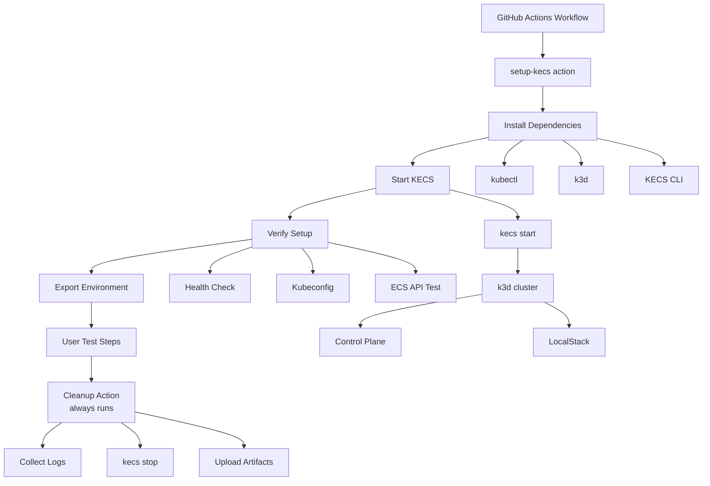

# ADR-0028: KECS GitHub Action

## Status

Proposed

## Context

When using KECS to test ECS workflows in GitHub Actions, the following manual setup is currently required:

1. Install kubectl/k3d
2. Build or download KECS binary
3. Start KECS instance
4. Configure AWS CLI
5. Cleanup after test execution

### Current Challenges

Looking at the existing `.github/workflows/kecs-on-actions.yml`:

- **Complex Setup**: Requires 100+ lines of YAML configuration
- **Duplicate Code**: Same setup repeated across workflows
- **Error Handling**: Log collection on failure implemented individually per workflow
- **Platform Dependencies**: Architecture detection and binary selection logic scattered
- **Maintainability**: KECS API changes impact multiple workflows

### Lessons from Existing Implementation

**Successful Patterns**:
- Unified cluster creation via `kecs start` command
- Automated kubeconfig retrieval
- Startup verification via health checks
- Detailed logging and debug information

**Areas for Improvement**:
- Setup and cleanup consistency
- Environment variable standardization
- Error case handling

### Requirements

1. **Easy to Use**: Setup KECS with just a few lines of YAML
2. **Reusability**: Usable across multiple workflows
3. **Auto Cleanup**: Reliable resource deletion after tests
4. **Multi-platform**: Support both amd64/arm64
5. **Debuggability**: Detailed logs on failure
6. **Port-forward Integration**: Seamless integration with automatic agent management

## Decision

Provide KECS integration as a GitHub Actions custom action.

### Architecture



### Implementation Approach

#### 1. Composite Action Structure

**Note**: KECS includes k3d SDK (v5.8.3) internally, so k3d installation is not required. KECS CLI handles all cluster operations through the embedded SDK.

### Key Design Points

1. **No k3d Installation Required**: KECS embeds k3d SDK (v5.8.3), all cluster operations handled internally
2. **Single Binary Dependency**: Only KECS CLI and kubectl needed
3. **Simplified Setup**: Fewer installation steps, faster execution
4. **Version Consistency**: k3d version matched with KECS release
5. **Automatic Agent Management**: Port-forward agent auto-starts on first use, auto-stops with instance

```yaml
# kecs-action/action.yml
name: 'Setup KECS'
description: 'Set up KECS (Kubernetes-based ECS Compatible Service) for testing'
branding:
  icon: 'box'
  color: 'blue'

inputs:
  kecs-version:
    description: 'KECS version to install'
    required: false
    default: 'latest'
  instance-name:
    description: 'KECS instance name'
    required: false
    default: ''  # Auto-generated if empty
  api-port:
    description: 'AWS API port'
    required: false
    default: '5373'
  admin-port:
    description: 'Admin API port'
    required: false
    default: '5374'
  additional-localstack-services:
    description: 'Additional LocalStack services (comma-separated)'
    required: false
    default: ''
  timeout:
    description: 'Timeout for cluster creation'
    required: false
    default: '10m'
  debug:
    description: 'Enable debug logging'
    required: false
    default: 'false'

outputs:
  instance-name:
    description: 'Actual KECS instance name'
    value: ${{ steps.start.outputs.instance-name }}
  endpoint:
    description: 'KECS API endpoint URL'
    value: ${{ steps.start.outputs.endpoint }}
  admin-endpoint:
    description: 'KECS admin endpoint URL'
    value: ${{ steps.start.outputs.admin-endpoint }}
  kubeconfig:
    description: 'Path to kubeconfig file'
    value: ${{ steps.start.outputs.kubeconfig }}

runs:
  using: 'composite'
  steps:
    - name: Install kubectl
      shell: bash
      run: ${{ github.action_path }}/scripts/install-kubectl.sh

    - name: Download KECS CLI
      shell: bash
      run: |
        VERSION="${{ inputs.kecs-version }}"
        ${{ github.action_path }}/scripts/download-kecs.sh "$VERSION"

    - name: Start KECS
      id: start
      shell: bash
      run: |
        INSTANCE="${{ inputs.instance-name }}"
        if [ -z "$INSTANCE" ]; then
          INSTANCE="actions-$(date +%s)"
        fi

        # Start KECS with specified configuration
        kecs start \
          --instance "$INSTANCE" \
          --api-port ${{ inputs.api-port }} \
          --admin-port ${{ inputs.admin-port }} \
          ${{ inputs.additional-localstack-services && format('--additional-localstack-services {0}', inputs.additional-localstack-services) || '' }} \
          --timeout ${{ inputs.timeout }}

        # Export outputs
        echo "instance-name=$INSTANCE" >> $GITHUB_OUTPUT
        echo "endpoint=http://localhost:${{ inputs.api-port }}" >> $GITHUB_OUTPUT
        echo "admin-endpoint=http://localhost:${{ inputs.admin-port }}" >> $GITHUB_OUTPUT

        # Get kubeconfig
        KUBECONFIG_PATH="/tmp/kecs-${INSTANCE}.kubeconfig"
        kecs kubeconfig get "$INSTANCE" > "$KUBECONFIG_PATH"
        echo "kubeconfig=$KUBECONFIG_PATH" >> $GITHUB_OUTPUT

    - name: Verify KECS
      shell: bash
      run: |
        ${{ github.action_path }}/scripts/verify-kecs.sh \
          "${{ steps.start.outputs.endpoint }}" \
          "${{ steps.start.outputs.admin-endpoint }}"

    - name: Export Environment
      shell: bash
      run: |
        echo "AWS_ENDPOINT_URL=${{ steps.start.outputs.endpoint }}" >> $GITHUB_ENV
        echo "KECS_ENDPOINT=${{ steps.start.outputs.endpoint }}" >> $GITHUB_ENV
        echo "KECS_ADMIN_ENDPOINT=${{ steps.start.outputs.admin-endpoint }}" >> $GITHUB_ENV
        echo "KUBECONFIG=${{ steps.start.outputs.kubeconfig }}" >> $GITHUB_ENV
        echo "KECS_INSTANCE=${{ steps.start.outputs.instance-name }}" >> $GITHUB_ENV
```

#### 4. Port Forward Integration (Optional)

**Note**: Port-forward agent is automatically managed, no explicit startup required.

KECS port-forward agent (see ADR-0026) has the following characteristics:

1. **Auto-start**: Automatically starts on first `kecs port-forward start` command
2. **Daemon Management**: One agent process per instance
3. **Auto Cleanup**: Automatically stops with `kecs stop`

When using port-forward in GitHub Actions:

```yaml
# Port forwarding is automatically managed
- name: Setup Port Forward (if needed)
  run: |
    # Agent starts automatically on first use
    kecs port-forward start service default/my-service --local-port 8080

    # Or use configuration file
    kecs port-forward run --config port-forward.yaml

- name: Test Service via Port Forward
  run: |
    # Access forwarded service
    curl http://localhost:8080/health

# No explicit cleanup needed - handled by kecs stop
```

**Recommended Approach**:
- Port-forward started manually by users only when needed
- Not included in the action, explicitly controlled in user workflows
- Agent management delegated to KECS CLI
```

#### 2. Cleanup Action

```yaml
# kecs-action/cleanup/action.yml
name: 'Cleanup KECS'
description: 'Clean up KECS resources'

inputs:
  instance-name:
    description: 'KECS instance name to cleanup'
    required: true
  collect-logs:
    description: 'Collect logs before cleanup'
    required: false
    default: 'true'

runs:
  using: 'composite'
  steps:
    - name: Collect Logs
      if: inputs.collect-logs == 'true'
      shell: bash
      run: |
        INSTANCE="${{ inputs.instance-name }}"

        # Create logs directory
        mkdir -p kecs-logs

        # KECS logs
        kecs logs --instance "$INSTANCE" > kecs-logs/kecs.log 2>&1 || true

        # Kubernetes logs if accessible
        if [ -n "$KUBECONFIG" ] && kubectl cluster-info &>/dev/null; then
          kubectl get pods -n kecs-system -o yaml > kecs-logs/kecs-pods.yaml 2>&1 || true
          kubectl logs -n kecs-system -l app=kecs-controlplane --tail=200 > kecs-logs/controlplane.log 2>&1 || true
          kubectl logs -n kecs-system -l app=localstack --tail=200 > kecs-logs/localstack.log 2>&1 || true
        fi

        # KECS cluster info (uses embedded k3d SDK)
        kecs list > kecs-logs/kecs-clusters.txt 2>&1 || true

    - name: Upload Logs
      if: always() && inputs.collect-logs == 'true'
      uses: actions/upload-artifact@v4
      with:
        name: kecs-logs-${{ inputs.instance-name }}
        path: kecs-logs/

    - name: Stop KECS
      shell: bash
      run: |
        kecs stop --instance "${{ inputs.instance-name }}" || {
          echo "Warning: Failed to stop KECS gracefully"
          # KECS handles cluster cleanup internally via k3d SDK
        }
```

#### 3. Installation Scripts

**kubectl installation** (`scripts/install-kubectl.sh`):
```bash
#!/bin/bash
set -e

if command -v kubectl &> /dev/null; then
  echo "kubectl already installed: $(kubectl version --client --short)"
  exit 0
fi

# Detect architecture
ARCH=$(uname -m)
case $ARCH in
  x86_64) KUBECTL_ARCH="amd64" ;;
  aarch64|arm64) KUBECTL_ARCH="arm64" ;;
  *) echo "Unsupported architecture: $ARCH"; exit 1 ;;
esac

# Download and install
KUBECTL_VERSION=$(curl -L -s https://dl.k8s.io/release/stable.txt)
curl -LO "https://dl.k8s.io/release/${KUBECTL_VERSION}/bin/linux/${KUBECTL_ARCH}/kubectl"
chmod +x kubectl
sudo mv kubectl /usr/local/bin/
kubectl version --client
```

**Note**: k3d installation is not needed as KECS embeds k3d SDK v5.8.3 internally.

**KECS download** (`scripts/download-kecs.sh`):
```bash
#!/bin/bash
set -e

VERSION="${1:-latest}"

# Detect architecture
ARCH=$(uname -m)
case $ARCH in
  x86_64) KECS_ARCH="amd64" ;;
  aarch64|arm64) KECS_ARCH="arm64" ;;
  *) echo "Unsupported architecture: $ARCH"; exit 1 ;;
esac

if [ "$VERSION" = "latest" ]; then
  # Get latest release
  VERSION=$(curl -s https://api.github.com/repos/nandemo-ya/kecs/releases/latest | grep '"tag_name":' | sed -E 's/.*"([^"]+)".*/\1/')
fi

# Download binary
URL="https://github.com/nandemo-ya/kecs/releases/download/${VERSION}/kecs-linux-${KECS_ARCH}"
echo "Downloading KECS ${VERSION} for ${KECS_ARCH}..."
curl -L "$URL" -o /tmp/kecs
chmod +x /tmp/kecs
sudo mv /tmp/kecs /usr/local/bin/kecs
kecs version
```

**Verification** (`scripts/verify-kecs.sh`):
```bash
#!/bin/bash
set -e

API_ENDPOINT="$1"
ADMIN_ENDPOINT="$2"

echo "Verifying KECS at $API_ENDPOINT..."

# Health check with retry
for i in {1..30}; do
  if curl -sf "${ADMIN_ENDPOINT}/health" > /dev/null; then
    echo "✅ KECS health check passed"
    break
  fi

  if [ $i -eq 30 ]; then
    echo "❌ KECS health check failed after 30 attempts"
    exit 1
  fi

  echo "Attempt $i: KECS not ready, waiting..."
  sleep 2
done

# Test ECS API
echo "Testing ECS API..."
curl -X POST "${API_ENDPOINT}/" \
  -H "Content-Type: application/x-amz-json-1.1" \
  -H "X-Amz-Target: AmazonEC2ContainerServiceV20141113.ListClusters" \
  -d '{}' || {
    echo "❌ ECS API test failed"
    exit 1
  }

echo "✅ KECS is ready"
```

### Usage Examples

#### Basic Usage

```yaml
name: ECS Workflow Test

on: [push]

jobs:
  test:
    runs-on: ubuntu-latest
    steps:
      - uses: actions/checkout@v4

      - name: Setup KECS
        uses: nandemo-ya/kecs-action@v1
        id: kecs

      - name: Run ECS Tests
        run: |
          # KECS is ready, AWS_ENDPOINT_URL is set
          aws ecs create-cluster --cluster-name test
          aws ecs list-clusters

      - name: Cleanup KECS
        if: always()
        uses: nandemo-ya/kecs-action/cleanup@v1
        with:
          instance-name: ${{ steps.kecs.outputs.instance-name }}
          # Note: Port-forward agent is automatically stopped with kecs stop
```

#### Advanced Usage

```yaml
name: Multi-Service Test

on: [push]

jobs:
  test:
    runs-on: ubuntu-latest
    steps:
      - uses: actions/checkout@v4

      - name: Setup KECS with S3 and DynamoDB
        uses: nandemo-ya/kecs-action@v1
        id: kecs
        with:
          kecs-version: v0.1.0
          instance-name: my-test
          additional-localstack-services: s3,dynamodb,sqs
          debug: true

      - name: Deploy ECS Service
        run: |
          # Register task definition
          aws ecs register-task-definition --cli-input-json file://task-def.json

          # Create service
          aws ecs create-service \
            --cluster default \
            --service-name my-app \
            --task-definition my-app:1 \
            --desired-count 2

      - name: Test Service Discovery
        run: |
          # Access Kubernetes resources
          export KUBECONFIG=${{ steps.kecs.outputs.kubeconfig }}
          kubectl get pods -n default-us-east-1

      - name: Setup Port Forward (Optional)
        run: |
          # Port forward to access service from host
          kecs port-forward start service default/my-app --local-port 8080

      - name: Test via Port Forward
        run: |
          curl http://localhost:8080/health

      - name: Cleanup
        if: always()
        uses: nandemo-ya/kecs-action/cleanup@v1
        with:
          instance-name: ${{ steps.kecs.outputs.instance-name }}
```

#### Integration with Scenario Tests

```yaml
name: Scenario Tests

on: [push]

jobs:
  test:
    runs-on: ubuntu-latest
    steps:
      - uses: actions/checkout@v4

      - name: Setup KECS
        uses: nandemo-ya/kecs-action@v1
        id: kecs

      - name: Run Testcontainers Tests
        run: |
          # Testcontainers can use existing KECS instance
          export KECS_CONTAINER_ID=$(docker ps -q -f "name=kecs")
          cd tests/scenarios && go test ./...

      - name: Cleanup
        if: always()
        uses: nandemo-ya/kecs-action/cleanup@v1
        with:
          instance-name: ${{ steps.kecs.outputs.instance-name }}
```

## Consequences

### Positive

1. **Improved Developer Experience**
   - Complete KECS setup in just a few lines
   - Unified interface
   - Clear error messages

2. **Better Maintainability**
   - Centralized setup logic
   - Easy KECS version upgrades
   - Consistency across workflows

3. **Enhanced Debuggability**
   - Automatic log collection
   - Detailed error information
   - Reproducible environment

4. **Efficient CI/CD**
   - Reduced setup time (dependency caching)
   - Parallel execution support
   - Proper resource cleanup

### Negative

1. **Additional Maintenance Cost**
   - Custom action maintenance
   - KECS version compatibility management
   - Documentation updates

2. **Additional Dependencies**
   - Dependency on GitHub Actions ecosystem
   - Action version management

3. **Learning Curve**
   - Learning new interface
   - Migrating existing workflows

### Risks

1. **Breaking Changes**
   - KECS CLI changes affecting the action
   - Mitigation: Semantic versioning and changelog

2. **Platform Compatibility**
   - Operation on new GitHub Actions runners
   - Mitigation: Regular testing and CI verification

3. **Resource Leaks**
   - Resources remaining after cleanup failure
   - Mitigation: Forced cleanup and timeout

## Alternatives Considered

### 1. Docker Container Action
- **Rejected**: Complexity of nested Docker execution, performance degradation

### 2. JavaScript Action
- **Rejected**: Shell scripts are sufficient, prefer avoiding Node.js dependency

### 3. Workflow Template
- **Rejected**: Low reusability, difficult to propagate changes

### 4. Separate k3d Installation
- **Rejected**: KECS already embeds k3d SDK v5.8.3, redundant installation

## Migration Plan

### Phase 1: Development & Testing
- Implement custom action
- Test with existing workflows
- Create documentation

### Phase 2: Dogfooding
- Use in KECS's own CI
- Collect feedback and improve
- Discover edge cases

### Phase 3: Public Release
- Publish to GitHub Marketplace
- Migration guide for existing workflows
- Community support

### Phase 4: Legacy Support
- Deprecate existing manual setup patterns
- Support migration period (6 months)
- Final removal

## References

- [Existing KECS on Actions](.github/workflows/kecs-on-actions.yml)
- [Scenario Tests Workflow](.github/workflows/scenario-tests.yml)
- [ADR-0011: Scenario-Based Testing](./0011-scenario-based-testing.md)
- [ADR-0018: Control Plane in k3d Cluster](./0018-control-plane-in-cluster.md)
- [GitHub Actions: Creating Composite Actions](https://docs.github.com/en/actions/creating-actions/creating-a-composite-action)
