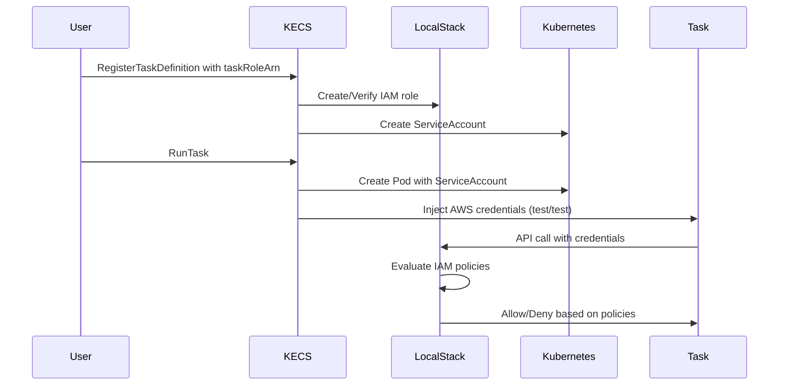

# IAM Integration Guide

KECS leverages LocalStack's IAM service to provide full AWS IAM functionality for ECS tasks, enabling secure access to AWS services in your local environment.

## Overview

The IAM integration:
- Creates IAM roles directly in LocalStack
- Associates IAM roles with Kubernetes ServiceAccounts
- Injects AWS credentials into task containers
- Relies on LocalStack for policy evaluation and access control

## How It Works



## Task Role Configuration

### In Task Definition

```json
{
  "family": "my-task",
  "taskRoleArn": "arn:aws:iam::123456789012:role/my-task-role",
  "executionRoleArn": "arn:aws:iam::123456789012:role/ecsTaskExecutionRole",
  "containerDefinitions": [{
    "name": "my-app",
    "image": "my-app:latest",
    "memory": 256
  }]
}
```

### Created Kubernetes Resources

When a task with an IAM role is registered, KECS creates:

1. **ServiceAccount**: Named `{role-name}-sa`
```yaml
apiVersion: v1
kind: ServiceAccount
metadata:
  name: kecs-my-task-role-sa
  namespace: default
  annotations:
    kecs.io/iam-role-arn: "arn:aws:iam::123456789012:role/my-task-role"
    kecs.io/iam-role-name: "kecs-my-task-role"
    kecs.io/task-definition-arn: "arn:aws:ecs:us-east-1:123456789012:task-definition/my-task:1"
```

2. **Pod Configuration**: With injected AWS credentials
```yaml
apiVersion: v1
kind: Pod
metadata:
  name: ecs-task-xxxxx
spec:
  serviceAccountName: kecs-my-task-role-sa
  containers:
  - name: my-app
    env:
    - name: AWS_ACCESS_KEY_ID
      value: "test"
    - name: AWS_SECRET_ACCESS_KEY
      value: "test"
    - name: AWS_DEFAULT_REGION
      value: "us-east-1"
```

## How LocalStack Handles IAM

LocalStack provides a fully functional IAM service that:
- Evaluates IAM policies for all API requests
- Supports role assumption and temporary credentials
- Implements policy conditions and resource-based policies
- Handles both inline and managed policies

When your task makes an AWS API call:
1. The AWS SDK uses the injected credentials
2. The request goes to LocalStack via the proxy configuration
3. LocalStack checks the IAM policies attached to the role
4. Access is granted or denied based on the policy evaluation

## Creating Custom IAM Roles

### Using AWS CLI with LocalStack

```bash
# Create a trust policy
cat > trust-policy.json <<EOF
{
  "Version": "2012-10-17",
  "Statement": [{
    "Effect": "Allow",
    "Principal": {
      "Service": "ecs-tasks.amazonaws.com"
    },
    "Action": "sts:AssumeRole"
  }]
}
EOF

# Create the role
aws iam create-role \
  --role-name my-task-role \
  --assume-role-policy-document file://trust-policy.json \
  --endpoint-url http://localhost:4566

# Attach a policy
aws iam put-role-policy \
  --role-name my-task-role \
  --policy-name my-policy \
  --policy-document file://policy.json \
  --endpoint-url http://localhost:4566
```

### Using KECS API

KECS automatically creates roles when task definitions reference them:

```bash
# Register task definition with role
aws ecs register-task-definition \
  --family my-task \
  --task-role-arn arn:aws:iam::123456789012:role/my-task-role \
  --container-definitions '[{"name":"app","image":"myapp:latest","memory":256}]'
```

## Task Execution Role

The execution role is used by the ECS agent to:
- Pull container images from ECR
- Send container logs to CloudWatch

KECS provides a default execution role policy:

```json
{
  "Version": "2012-10-17",
  "Statement": [
    {
      "Effect": "Allow",
      "Action": [
        "ecr:GetAuthorizationToken",
        "ecr:BatchCheckLayerAvailability",
        "ecr:GetDownloadUrlForLayer",
        "ecr:BatchGetImage",
        "logs:CreateLogStream",
        "logs:PutLogEvents"
      ],
      "Resource": "*"
    }
  ]
}
```

## Troubleshooting

### ServiceAccount Not Found

If a pod fails with "ServiceAccount not found":
1. Check that the IAM role was created in LocalStack
2. Verify the task definition includes the correct role ARN
3. Ensure the role name has the correct prefix (default: `kecs-`)

### Permission Denied

If the application gets permission denied:
1. Check the IAM policy attached to the role
2. Verify the policy mapping in RBAC rules
3. Check pod logs for ServiceAccount token issues

### Debugging Commands

```bash
# List ServiceAccounts created by KECS
kubectl get serviceaccounts -l app.kubernetes.io/managed-by=kecs

# View RBAC rules for a role
kubectl describe role kecs-my-task-role-sa

# Check pod's ServiceAccount
kubectl describe pod <pod-name> | grep "Service Account"

# View IAM roles in LocalStack
aws iam list-roles --endpoint-url http://localhost:4566
```

## Best Practices

1. **Use Least Privilege**: Grant only the minimum permissions needed
2. **Separate Roles**: Use different roles for different tasks
3. **Role Naming**: Use descriptive names that indicate the task's purpose
4. **Policy Documentation**: Document what each policy allows and why
5. **Regular Audits**: Review and remove unused roles periodically

## Advantages of Using LocalStack IAM

1. **Full IAM Compatibility**: All IAM features work as in real AWS
2. **No Translation Layer**: Policies are evaluated directly by LocalStack
3. **Simplified Implementation**: No complex RBAC mapping required
4. **Future-Proof**: New AWS services automatically supported

## Limitations

- Uses static test credentials (suitable for local development)
- Cross-account role assumption depends on LocalStack support
- Advanced IAM features depend on LocalStack implementation