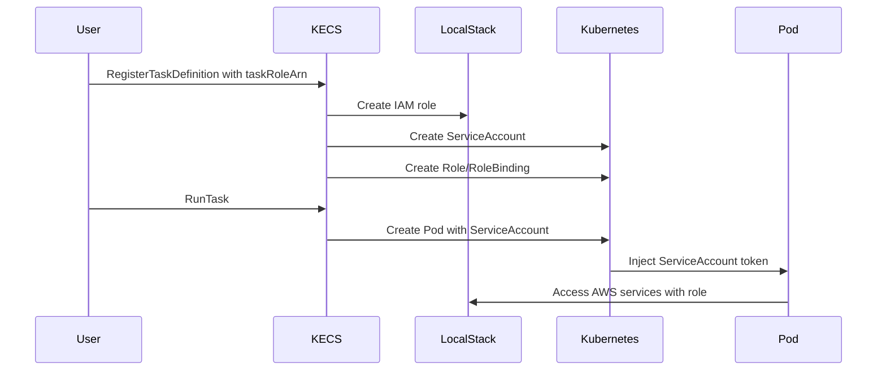

# IAM Integration Guide

KECS provides integration between AWS IAM roles and Kubernetes ServiceAccounts, enabling ECS tasks to assume IAM roles for accessing AWS services through LocalStack.

## Overview

The IAM integration automatically:
- Creates Kubernetes ServiceAccounts for ECS task roles
- Maps IAM policies to Kubernetes RBAC rules
- Configures pods to use the appropriate ServiceAccount
- Manages the lifecycle of IAM roles in LocalStack

## How It Works



## Task Role Configuration

### In Task Definition

```json
{
  "family": "my-task",
  "taskRoleArn": "arn:aws:iam::123456789012:role/my-task-role",
  "executionRoleArn": "arn:aws:iam::123456789012:role/ecsTaskExecutionRole",
  "containerDefinitions": [{
    "name": "my-app",
    "image": "my-app:latest",
    "memory": 256
  }]
}
```

### Created Kubernetes Resources

When a task with an IAM role is registered, KECS creates:

1. **ServiceAccount**: Named `{role-name}-sa`
```yaml
apiVersion: v1
kind: ServiceAccount
metadata:
  name: kecs-my-task-role-sa
  namespace: default
  annotations:
    kecs.io/iam-role-arn: "arn:aws:iam::123456789012:role/my-task-role"
    kecs.io/iam-role-name: "kecs-my-task-role"
    kecs.io/task-definition-arn: "arn:aws:ecs:us-east-1:123456789012:task-definition/my-task:1"
```

2. **Role**: With RBAC rules based on IAM policies
```yaml
apiVersion: rbac.authorization.k8s.io/v1
kind: Role
metadata:
  name: kecs-my-task-role-sa
  namespace: default
rules:
- apiGroups: [""]
  resources: ["configmaps", "secrets"]
  verbs: ["get"]
```

3. **RoleBinding**: Linking ServiceAccount to Role
```yaml
apiVersion: rbac.authorization.k8s.io/v1
kind: RoleBinding
metadata:
  name: kecs-my-task-role-sa
  namespace: default
subjects:
- kind: ServiceAccount
  name: kecs-my-task-role-sa
  namespace: default
roleRef:
  kind: Role
  name: kecs-my-task-role-sa
  apiGroup: rbac.authorization.k8s.io
```

## IAM Policy Mapping

KECS maps common IAM actions to Kubernetes RBAC permissions:

| IAM Action | Kubernetes Resources | Kubernetes Verbs |
|------------|---------------------|------------------|
| s3:GetObject | configmaps, secrets | get |
| s3:PutObject | configmaps | create, update |
| logs:CreateLogGroup | events | create |
| logs:CreateLogStream | events | create |
| logs:PutLogEvents | events | create, patch |
| ssm:GetParameter | secrets, configmaps | get |
| secretsmanager:GetSecretValue | secrets | get |

## Creating Custom IAM Roles

### Using AWS CLI with LocalStack

```bash
# Create a trust policy
cat > trust-policy.json <<EOF
{
  "Version": "2012-10-17",
  "Statement": [{
    "Effect": "Allow",
    "Principal": {
      "Service": "ecs-tasks.amazonaws.com"
    },
    "Action": "sts:AssumeRole"
  }]
}
EOF

# Create the role
aws iam create-role \
  --role-name my-task-role \
  --assume-role-policy-document file://trust-policy.json \
  --endpoint-url http://localhost:4566

# Attach a policy
aws iam put-role-policy \
  --role-name my-task-role \
  --policy-name my-policy \
  --policy-document file://policy.json \
  --endpoint-url http://localhost:4566
```

### Using KECS API

KECS automatically creates roles when task definitions reference them:

```bash
# Register task definition with role
aws ecs register-task-definition \
  --family my-task \
  --task-role-arn arn:aws:iam::123456789012:role/my-task-role \
  --container-definitions '[{"name":"app","image":"myapp:latest","memory":256}]'
```

## Task Execution Role

The execution role is used by the ECS agent to:
- Pull container images from ECR
- Send container logs to CloudWatch

KECS provides a default execution role policy:

```json
{
  "Version": "2012-10-17",
  "Statement": [
    {
      "Effect": "Allow",
      "Action": [
        "ecr:GetAuthorizationToken",
        "ecr:BatchCheckLayerAvailability",
        "ecr:GetDownloadUrlForLayer",
        "ecr:BatchGetImage",
        "logs:CreateLogStream",
        "logs:PutLogEvents"
      ],
      "Resource": "*"
    }
  ]
}
```

## Troubleshooting

### ServiceAccount Not Found

If a pod fails with "ServiceAccount not found":
1. Check that the IAM role was created in LocalStack
2. Verify the task definition includes the correct role ARN
3. Ensure the role name has the correct prefix (default: `kecs-`)

### Permission Denied

If the application gets permission denied:
1. Check the IAM policy attached to the role
2. Verify the policy mapping in RBAC rules
3. Check pod logs for ServiceAccount token issues

### Debugging Commands

```bash
# List ServiceAccounts created by KECS
kubectl get serviceaccounts -l app.kubernetes.io/managed-by=kecs

# View RBAC rules for a role
kubectl describe role kecs-my-task-role-sa

# Check pod's ServiceAccount
kubectl describe pod <pod-name> | grep "Service Account"

# View IAM roles in LocalStack
aws iam list-roles --endpoint-url http://localhost:4566
```

## Best Practices

1. **Use Least Privilege**: Grant only the minimum permissions needed
2. **Separate Roles**: Use different roles for different tasks
3. **Role Naming**: Use descriptive names that indicate the task's purpose
4. **Policy Documentation**: Document what each policy allows and why
5. **Regular Audits**: Review and remove unused roles periodically

## Limitations

- Policy mapping covers common AWS services; custom mappings may be needed
- Complex IAM conditions are not fully supported
- Resource-based policies require manual RBAC configuration
- Cross-account role assumption is not supported